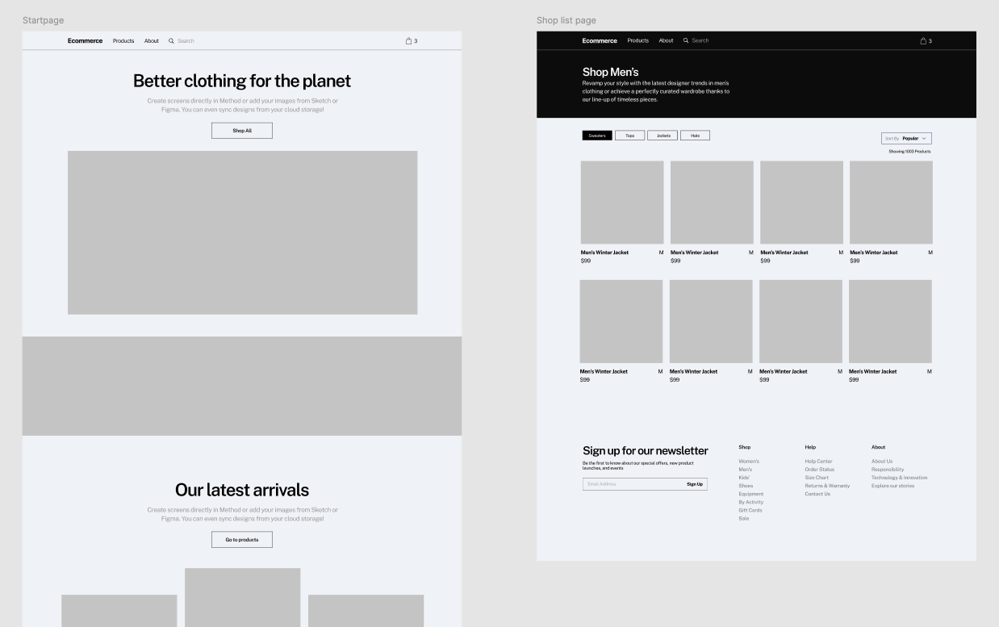

import ContentCountdownWrapper from "@site/src/components/ContentCountdownWrapper/ContentCountdownWrapper";

Kort beskrivning av uppgiften:

Gruppen ska bygga en webbplats som skall styras av Storyblok.  Skall byggas efter figma design.
Val av bilder och vad för typ av produkter är upp till er. **Mer information kommer snart.**

<ContentCountdownWrapper datetime="2025-08-25T09:00:00Z">

Enklare e-commerce site som skall styras av Storyblok.  Skall byggas efter figma design.
Val av bilder och vad för typ av produkter är upp till er.  **Vi skall inte bygga cart funktionalitet!**

## **Material**

Figma: 
https://www.figma.com/design/tqmb6SbooCUQMek5WYzb2X/webb23-ecommerce?node-id=0-1&t=ocisBAFjWxOYK6q4-1

Boilerplate:

 https://github.com/bregzor/webb23-cms-boilerplate.git

## **Komponentstruktur**

Exempel på komponenter som skall finnas i ditt storyblok/repo projekt.
Utgå från wireframe i figma ovan för att bygga komponenternas datastruktur.

Tänk på att bygga återanvända komponenter i react världen, vi behöver inte repetera kod.

https://rjroopal.medium.com/atomic-design-pattern-structuring-your-react-application-970dd57520f8

**Content-types:**

- Page
- ProductPage
- Config

**Layout**

- Header
- Footer

**Nestade komponenter:**

- ProductList
- LatestProductsList
- SearchBar
- ImageBanner
- Hero
- ImageWithText

## Krav för G (Godkänt) - Gruppuppgift

För att få betyget **Godkänt** ska din lösning uppfylla följande krav:

1. Samtligt innehåll/sidor skall finnas i Storyblok och presenteras via er frontend (enligt figma)
2. Header navigation (en nivå) och footer hämtat från en Config story
3. Robots.txt (robots.js)
4. Sitemap genererat från Links API (sitemap.js)
5. Fungerade webbplats - deployat i Vercel miljö
6. Webhook aktiverad mot Vercel miljö för att kunna publicera ändringar

## Individuella krav för VG (Väl Godkänt)

För att få betyget VG ska din lösning uppfylla alla G-kriterier samt följande krav:

- Implementera en meny med flera nivåer för navigering mellan olika sidor på webbplatsen.
- Implementera en sökfunktion som tillåter användare att söka efter produkter på sidan (Client calls).  Ni kan öppna svaren i en modal eller alternativt rita direkt ut i sidan.
- Implementera i Hero komponenten dynamik så jag som redaktör har möjlighet
att ändra backgrundfärg för hela blocket.

## Tips

- Sätt upp erat repo tillsammans så ni sedan kan jobba isolerat i egna branches
- Skapa storyblok struktur och komponenter tillsammans så ni kan bolla mellan varandra
- Jobba med Kanban metoden, delegera tasks på komponent nivå
- Vill ni parprogrammera hela uppgiften så är det OK.

## Bonus

- Lägg till flerspråks hantering (en, sv) med multitree tänk
- Maxa lighthouse scores

## Deadline/Inlämning

**Senast torsdag nästa vecka kl 23.59.**

- En länk till den deployade webbplatsen.
- En github repo länk.
- Login till space:et
- Demo sista dagen

## **Hjälpmedel**

Fastnat? Se till att använda är google, allt finns dokumenterat..

Vercel: https://vercel.com/docs/getting-started-with-vercel/import

Metadata files: https://nextjs.org/docs/app/api-reference/file-conventions/metadata/robots

Webhooks: https://www.storyblok.com/docs/guide/in-depth/webhooks

https://www.storyblok.com/docs/api/content-delivery/v2/getting-started/introduction

</ContentCountdownWrapper>