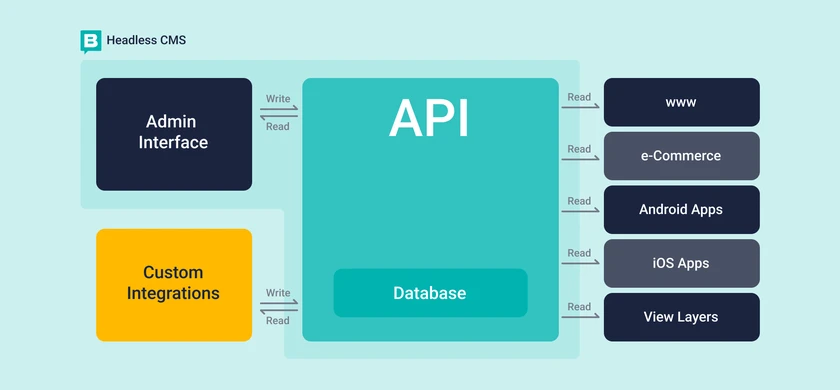

# **Vad är ett CMS?**

Ett **Content Management System** (CMS) är en “mjukvara” som används för att skapa, hantera och ändra digitalt innehåll på en webbplats utan att behöva ha djupa tekniska kunskaper inom kodning. CMS-plattformar gör det möjligt för användare att bygga och hantera webbplatser med hjälp av användarvänliga gränssnitt och verktyg.

1. **Innehållshantering**: Tillåter användare att enkelt skapa, redigera och publicera innehåll som texter, bilder, videor och annat media.
2. **Användarhantering**: Möjliggör olika användarroller och behörighetsnivåer, så att administratörer kan hantera vilka delar av webbplatsen olika användare kan redigera.
3. **Teman och Design**: Erbjuder teman och mallar som gör det enkelt att ändra webbplatsens utseende och layout utan att behöva koda.
4. **Plugins och Tillägg**: Stöd för plugins som utökar funktionaliteten på webbplatsen, exempelvis för SEO, e-handel, analys och sociala medier.
5. **SEO-verktyg**: Inkluderar verktyg och inställningar för sökmotoroptimering, vilket hjälper webbplatsen att rankas högre i sökmotorer.
6. **Mediehantering**: Hanterar uppladdning och visning av bilder, videor och andra mediefiler på webbplatsen.

# Ursprung

- **1980-talet:** De första systemen för att hantera innehåll utvecklades internt inom stora företag och organisationer. Dessa tidiga system var ofta skräddarsydda lösningar för att hantera specifika typer av digitalt innehåll.
- **1990-talet:** Under denna tid började webben att växa snabbt, och behovet av att kunna hantera stora mängder innehåll på webbsidor ökade. Det var då de första kommersiella CMS började dyka upp. Dessa system gjorde det möjligt för företag att skapa och hantera sina webbplatser mer effektivt.
- **2000-talet:** Öppna källkodsprojekt som WordPress, Joomla och Drupal lanserades, vilket demokratiserade tillgången till CMS. Dessa plattformar gjorde det möjligt för både småföretag och individer att enkelt skapa och hantera sina webbplatser.
- **Nutid:** Idag finns det en mängd olika CMS-lösningar, både öppna och kommersiella, som används för allt från enkla bloggar till komplexa företagsportaler. Med utvecklingen av molnteknologi och headless CMS har möjligheterna och flexibiliteten i innehållshantering ytterligare expanderat.

### **Populära CMS-plattformar**

- **WordPress**: Användarvänligt och flexibelt, idealiskt för bloggar, företagswebbplatser och e-handel.
- **Joomla**: Kraftfullt med många inbyggda funktioner, lämpligt för medelstora till stora webbplatser.
- **Drupal**: Känd för sin robusthet och säkerhet, ofta använd för stora och komplexa webbplatser.
- **Magento**: Specialiserat på e-handel med kraftfulla verktyg för att hantera onlinebutiker.
- **Shopify**: Molnbaserad plattform för att enkelt skapa och driva e-handelswebbplatser.
- Wix: Användarvänlig plattform för att skapa webbplatser med drag-and-drop-funktionalitet, lämplig för nybörjare och småföretag. Erbjuder en mängd anpassningsbara mallar och integrerade verktyg för e-handel, bloggning och mer. Wix är särskilt populär bland kreativa yrkesutövare och små företag som vill ha en professionell online-närvaro utan att behöva koda.
- Webflow:-:-
- Framer
- **Storyblok**: Ett headless CMS som kombinerar ett visuellt redigeringsgränssnitt med API-baserad innehållshantering för moderna webbapplikationer.

# Fördelar med att använda CMS

1. **Tidsbesparande:** Gör att webbplatsägare kan uppdatera innehåll snabbt och enkelt utan att behöva involvera utvecklare.
2. **Kostnadseffektivitet:** Genom att använda ett CMS kan företag spara pengar på utveckling och underhåll eftersom många uppgifter kan utföras internt.
3. **Säkerhet:** Många CMS har inbyggda säkerhetsfunktioner och uppdateringar som skyddar webbplatsen mot sårbarheter.

# Användningsområden

1. **Bloggar:** CMS används ofta för att driva personliga och företagsbloggar.
2. **E-handel:** Många e-handelsplattformar, som WooCommerce (en plugin för WordPress), är byggda på CMS.
3. **Företagswebbplatser:** Företag använder CMS för att hantera innehållet på sina webbplatser och hålla dem uppdaterade med den senaste informationen.
4. Är inte det mesta vi sätter med idag i ex sociala medier ett CMS?

# **Headless vs non Headless CMS?**

Ett headless CMS är en typ av Content Management System där backend och frontend är separerade. "Headless" innebär att CMS saknar en traditionell frontend, alltså den del som användarna ser och interagerar med. Istället levererar ett headless CMS innehåll via API till vilken typ av frontend som helst, vilket ger utvecklare större flexibilitet att bygga applikationer med olika teknologier.

- **Headless CMS**: Ett Content Management System som levererar innehåll via API, utan att ha en fast frontend. Innehållet kan visas på olika plattformar som webbplatser, mobilappar, och andra enheter.
- **Traditionellt (Non-Headless) CMS**: Ett CMS där backend och frontend är sammanbundna. Innehållshantering och visning sker inom samma system, och frontend-utseendet hanteras av CMS inbyggda verktyg.

# Vad ska man tänka på när man väljer ett CMS?

### 1. **Användarvänlighet**

- **Inlärningskurva**: Hur lätt är det för dig eller ditt team att lära sig och använda CMS? Välj ett system som matchar din tekniska nivå.
- **Redigeringsverktyg**: Finns det ett intuitivt gränssnitt för att skapa och redigera innehåll? Drag-and-drop-redigerare kan vara särskilt användbara.

### 2. **Flexibilitet och Skalbarhet**

- **Plugins och teman**: Kontrollera om CMS har ett brett utbud av plugins och teman för att anpassa din webbplats.
- **Skalbarhet**: Kan systemet hantera din webbplats när den växer? Vissa CMS är bättre lämpade för stora webbplatser med hög trafik.

### 3. **SEO-funktioner**

- **SEO-vänlighet**: Se till att CMS erbjuder bra stöd för SEO, såsom möjlighet att redigera metataggar, vänliga URL, och stöd för schema markup.

### 4. **Säkerhet**

- **Uppdateringar och support**: Hur ofta uppdateras CMSför att åtgärda säkerhetsbrister? Kontrollera också om det finns ett starkt community eller supportteam som kan hjälpa vid problem.
- **Säkerhetsfunktioner**: Inbyggda säkerhetsfunktioner såsom tvåfaktorsautentisering, brandväggar, och regelbundna säkerhetsuppdateringar är viktiga att överväga.

### 5. **Kostnad**

- **Initial kostnad**: Är CMSgratis, eller finns det licensavgifter? Överväg även kostnader för teman, plugins och eventuell utveckling.
- **Långsiktiga kostnader**: Räkna med kostnader för hosting, underhåll, säkerhetsuppdateringar och eventuella uppgraderingar.

### 6. **Support och community**

- **Supportnätverk**: Finns det tillgänglig support via ett community, forum, eller professionell hjälp? Ett stort och aktivt community kan vara en ovärderlig resurs.
- **Dokumentation**: Bra dokumentation kan hjälpa dig att snabbt lösa problem och lära dig systemet.

### 7. **Integrationer**

- **Tredjepartstjänster**: Om du behöver integrera CMSmed andra tjänster som CRM-system, e-postmarknadsföringsverktyg eller e-handelslösningar, se till att detta stöds.
- **API-åtkomst**: För mer avancerade behov kan API-åtkomst vara avgörande för att koppla CMStill andra applikationer.

### 8. **Framtidssäkerhet**

- **Aktiv utveckling**: Välj ett CMS som har en aktiv utvecklingsplan och regelbundna uppdateringar för att säkerställa att det förblir relevant och säkert.
- **Anpassningsbarhet**: Överväg hur lätt det är att göra ändringar och anpassningar över tid när dina behov förändras.