# Dagens agenda

- Om Storyblok
- Storyblok fördjupning
- Skapa vårat första storyblok call
- Rita ut vyer baserad på vår första story

# Storyblok

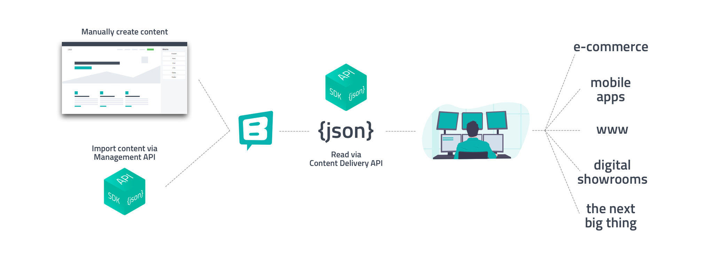

Storyblok är en flexibel och kraftfull headless CMS (Content Management System) som gör det möjligt för användare att skapa, hantera och publicera digitalt innehåll över olika plattformar och enheter. Med Storyblok kan användare skapa och redigera innehåll i en användarvänlig gränssnitt och sedan leverera detta innehåll via API till sina webbplatser, appar eller andra digitala kanaler. 

Dess modulära och blockbaserade system gör det enkelt att strukturera och organisera innehåll på ett dynamiskt sätt, vilket ger oss utvecklare och designers stor frihet att skapa engagerande och responsiva användarupplevelser.

# Funktioner

### **Headless Arkitektur**

Storyblok lagrar innehåll separat från frontend, vilket gör det möjligt att leverera innehåll till alla typer av digitala plattformar, inklusive webbplatser, mobila appar, och IoT-enheter.

### **Visuell Redigerare**

En av de unika egenskaperna hos Storyblok är dess visuella redigerare som tillåter användare att förhandsgranska och redigera innehåll i realtid. Detta underlättar för innehållsskapare att se hur ändringar kommer att se ut direkt på sidan.

### **Modulär Innehållshantering**

Innehåll kan organiseras i moduler eller komponenter, vilket gör det enkelt att återanvända och kombinera olika delar av innehållet på flera sidor eller kanaler.

### **API-baserad Integration**

Storyblok använder APIför att integrera med olika teknologier och plattformar, vilket gör det möjligt att sömlöst ansluta till frontend-ramverk som React, Vue.js, Angular, eller andra system som krävs för att bygga moderna digitala upplevelser.

### **Inbyggt Versionskontroll**

Användare kan enkelt spåra ändringar och återgå till tidigare versioner av innehåll, vilket ger extra säkerhet och kontroll över redigeringsprocessen.

### **Flerspråkighet och Lokalisering**

Storyblok stöder flerspråkiga webbplatser och lokalisering av innehåll, vilket gör det idealiskt för företag som behöver nå en global publik.

### **Kollaborationsverktyg**

Plattformen erbjuder funktioner för samarbete, som användarroller, behörighetsstyrning och arbetsflöden, vilket underlättar samarbete mellan teammedlemmar.

### **Omfattande Dokumentation och Support**

Storyblok erbjuder detaljerad dokumentation och support, vilket gör det lättare för utvecklare och innehållsskapare att komma igång och maximera systemets potential.

# Vad kostar det?

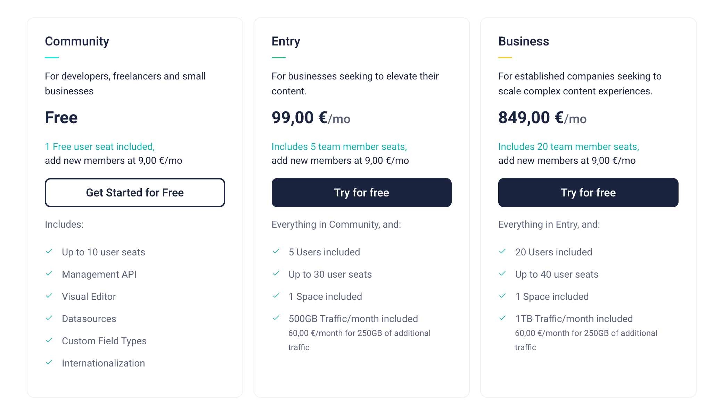

# Verktyget

Space

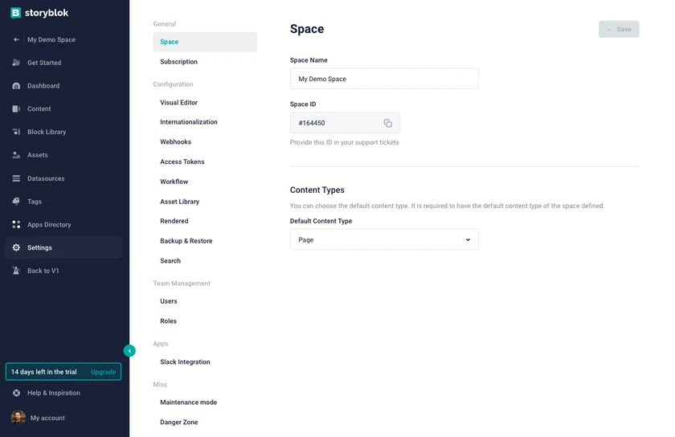

Ett storyblok space kan ni se som eget repository.  Kan vara specfikt till en webbplats eller datakälla för flertal medier.  Oftast har man ett eget space per webbplats/app.

# Dashboard

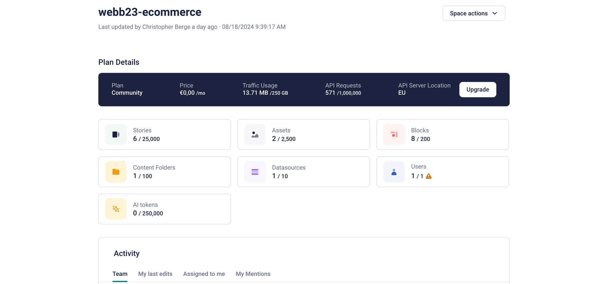

---

# Content

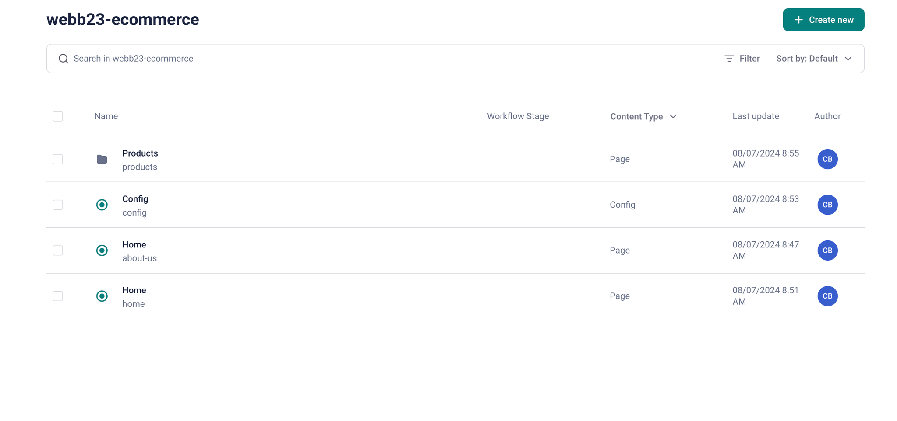

I Content kan man enkelt skapa och hantera innehåll genom det visuella gränssnittet. Redaktörer kan lägga till, redigera och organisera innehåll i form av "stories". Varje story kan innehålla olika typer av blocks som definieras av de komponenter som utvecklarna har skapat.

---

# Visual editor

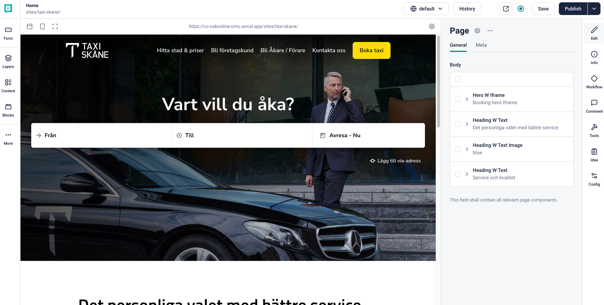

En av de bättre nyckelfunktionerna i Storyblok är visual editor.  Där man i realtid kan
bygga och se sina ändringar direkt i frontenden. Detta gör det väldigt enkelt och tydligt för redaktörer och jobba och bygga innehåll.

---

## Assets

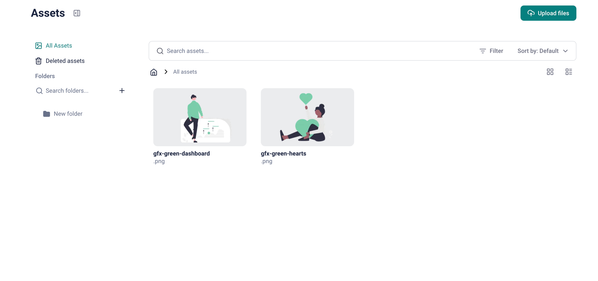

En mediabank för hela spacet, denna kan kopplas mot våra fält och blocks när vi skapar komponenter.   Går också att ladda upp och hantera material direkt i visual editorn.

---

## **Datasources**

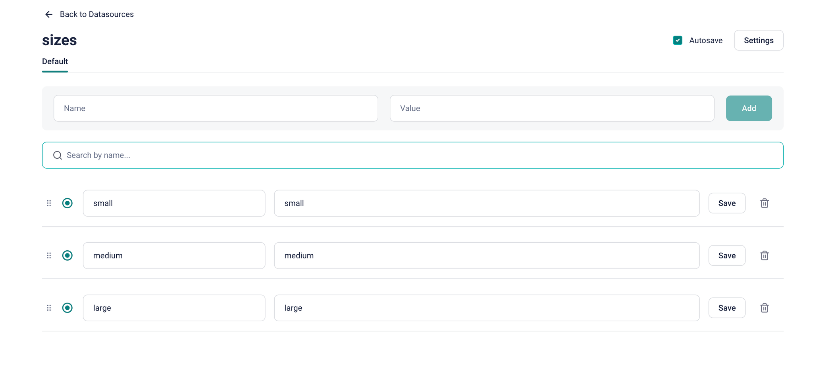

Datasources ger dig möjligheten att koppla Storyblok till externa datakällor eller skapa egna dynamiska datalistor som kan användas i ditt innehåll. Detta är särskilt användbart för att hantera dynamiska element som produktkataloger, kategorier eller annan data som behöver uppdateras och presenteras automatiskt på webbplatsen.

## **App Directory**

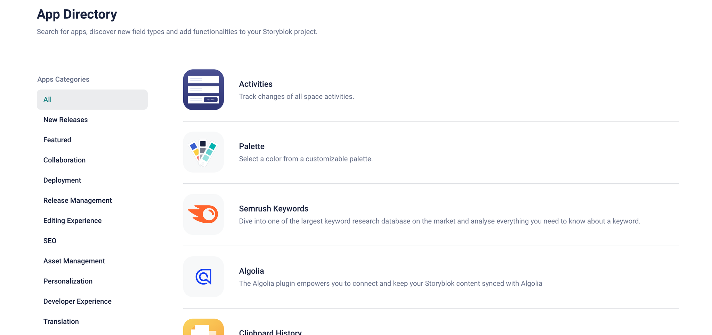

App Directory är en marknadsplats där du kan hitta och integrera olika appar och tillägg som utökar funktionaliteten i din Storyblok-installation. Detta inkluderar allt från SEO-verktyg och analysverktyg till tredjepartsintegrationer som e-handelssystem, marknadsföringsplattformar och mer. Genom att använda appar från App Directory kan du anpassa och förbättra ditt arbetsflöde och de möjligheter som Storyblok erbjuder.

---

# Blocks (Komponenter)

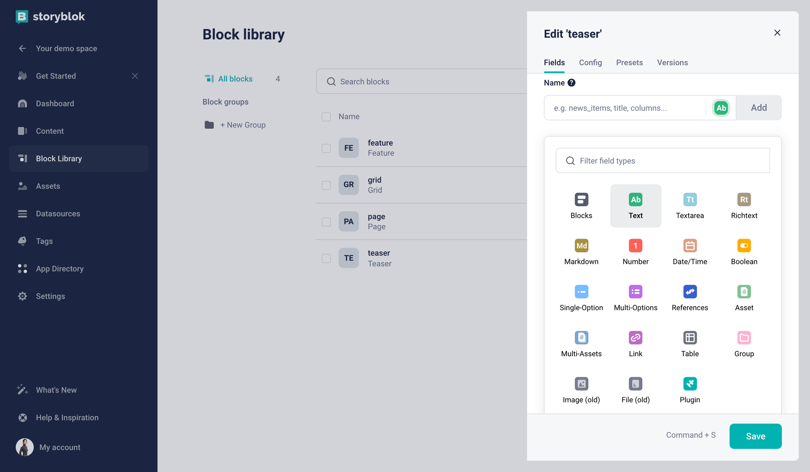

För att kunna skapa innehåll så måste man ha skapat blocks/komponenter innan.
Detta gör man oftast efter en design och datastruktur som vi är medvetna om sen tidigare.

Storyblok har ett vettigt gränssnitt (se bild ovan) för att skapa dessa komponenter som då innehåller alla fält som vi skall kunna påverka genom CMS:et samt konsumera via API:et.  Detta steg sätter egentligen hur storyn nedan kommer se ut samt även hur redaktörerna kommer arbeta.

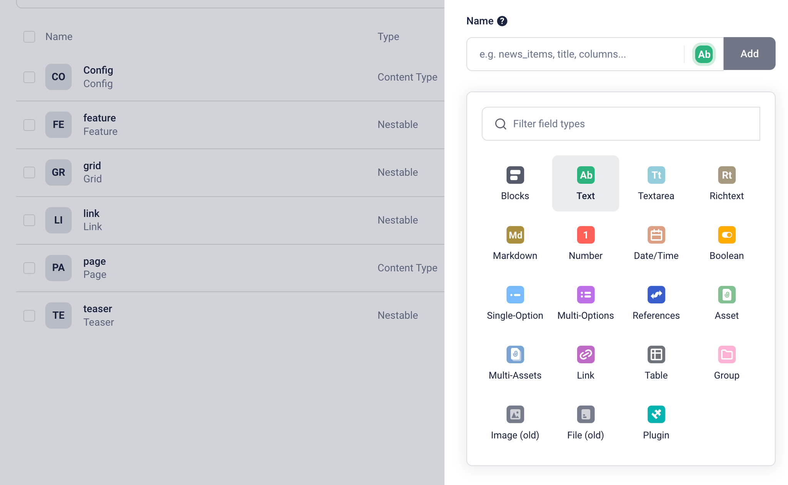

### Fälttyper

Det finns flertal fälttyper att välja mellan där man skapar ett schema.
Här kan vi också sätta validering för våra fält m.m, så redaktörerna gör rätt. 

---

# Content type (Mallar)

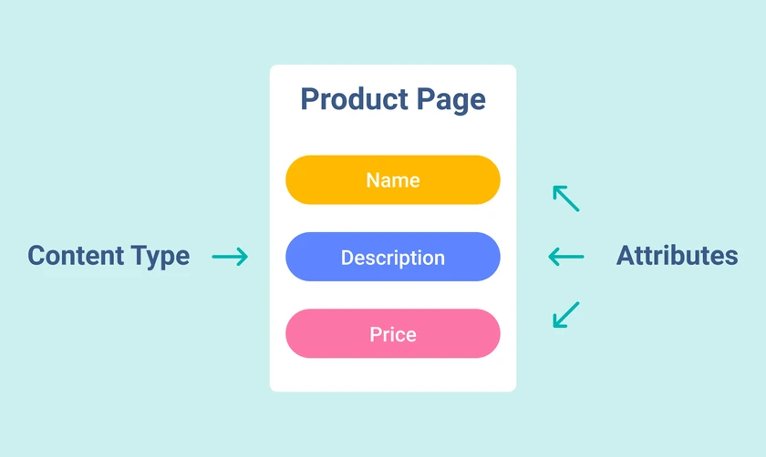

### Content type block

Ett sätt att skapa dina mallar för dina stories.  Exempelvis på content-type kan vara **Page, Post, Faq article, Product.** Denna typ används för att sätta en struktur för en sida.

### Nestable block

Komponent som endast används inom en story.  Exempelvis **Hero, Grid, Section, Slider, Image, ImageWithText.**
Denna typ används mest vid skapandet av generella sidkomponenter.  Vi använder våra nestade block i en specifik content-type struktur.

### Universal block

Kan användas som både content-type och nestable block. 

---

# Storyblok API

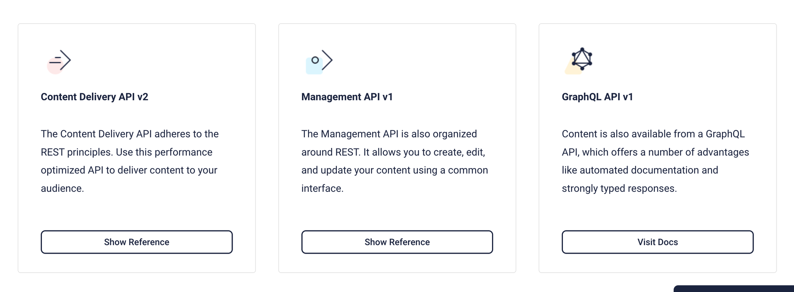

**Content delivery API:** 

Content delivery är en av de viktigaste funktionerna i Storyblok API:et. Det möjliggör hämtning av innehåll från Storyblok till din frontend-applikation. Genom att använda Content Delivery API kan du enkelt få tillgång till och visa upp det innehåll som skapats och hanterats i Storyblok CMS.
**Vi kommer använda detta!**

**Managment API:**

Management API som låter oss utvecklare programmera och automatisera olika aspekter av innehållshantering i Storyblok. Med detta API kan man skapa, uppdatera och ta bort innehåll, hantera arbetsflöden och utföra andra administrativa uppgifter programmatiskt. Detta är särskilt användbart för att bygga anpassade integreringar eller för att hantera storskaliga innehållsuppdateringar.

# **Story**

```jsx
{
 "story": {
   "name": "My third post",
   "created_at": "2024-02-08T16:26:24.425Z",
   "published_at": "2024-02-08T16:27:05.705Z",
   "id": 440448565,
   "uuid": "e656e146-f4ed-44a2-8017-013e5a9d9395",
   "content": {
     "_uid": "cfe0ff0b-3211-4bb7-8128-66e6ad262a56",
     "component": "page"
   },
   "slug": "my-third-post",
   "full_slug": "posts/my-third-post",
   "sort_by_date": null,
   "position": 0,
   "tag_list": [],
   "is_startpage": false,
   "parent_id": 440448337,
   "meta_data": null,
   "group_id": "b913a671-f1e9-436a-bc5d-2795d2740198",
   "first_published_at": "2024-02-08T16:27:05.705Z",
   "release_id": null,
   "lang": "default",
   "path": null,
   "alternates": [
     {
       "id": 440452827,
       "name": "Mein dritter Beitrag",
       "slug": "mein-dritter-beitrag",
       "published": true,
       "full_slug": "beitraege/mein-dritter-beitrag",
       "is_folder": false,
       "parent_id": 440452826
     }
   ],
   "default_full_slug": "posts/my-third-post",
   "translated_slugs": [
     {
       "path": "posts/my-third-post",
       "name": null,
       "lang": "fr",
       "published": null
     },
     {
       "path": "posts/mein-dritter-beitrag",
       "name": "Mein dritter Beitrag",
       "lang": "de",
       "published": true
     }
   ]
 }
}
```

I namnet Storyblok så har vi termen story, detta är själva datastrukturen som genereras vid varje entry i cms:et.  Utifrån storyn kan vi då rita ut det vi vill ha från datat.

Detta story objekt nedan representerar ett story “entry“ vid namn “Home”.
I grund och botten så kommer alla sidor man skapar i storyblok innehålla denna struktur. 
Vårt mål som utvecklare är att traversera detta objekt och rita ut önskad frontend.

```jsx
{
  "story": {
    "name": "Home",
    "created_at": "2024-06-03T13:20:52.242Z",
    "published_at": null,
    "id": 506179015,
    "uuid": "a462d6f0-d274-448f-935f-5369e942248d",
    "content": {
      "_uid": "89432eaf-8792-4f8c-a931-e62960ce2794",
      "body": [
        {
          "_uid": "cb0815dc-86e8-463a-9fab-b225edde23aa",
          "headline": "Hello world!",
          "component": "teaser",
          "_editable": "<!--#storyblok#{\"name\": \"teaser\", \"space\": \"291223\", \"uid\": \"cb0815dc-86e8-463a-9fab-b225edde23aa\", \"id\": \"506179015\"}-->"
        },
        {
          "_uid": "236b7733-bc11-4099-8261-11966736dfa4",
          "columns": [
            {
              "_uid": "4bb9665c-5dd7-453b-929c-6120a5a951b2",
              "name": "Feature 1",
              "component": "feature",
              "_editable": "<!--#storyblok#{\"name\": \"feature\", \"space\": \"291223\", \"uid\": \"4bb9665c-5dd7-453b-929c-6120a5a951b2\", \"id\": \"506179015\"}-->"
            },
            {
              "_uid": "872b1726-923c-4c08-8c5d-cb0892dc2835",
              "name": "Feature 2",
              "component": "feature",
              "_editable": "<!--#storyblok#{\"name\": \"feature\", \"space\": \"291223\", \"uid\": \"872b1726-923c-4c08-8c5d-cb0892dc2835\", \"id\": \"506179015\"}-->"
            },
            {
              "_uid": "a8f1d82c-660a-4cc6-9ed2-534d13cedea5",
              "name": "Feature 3",
              "component": "feature",
              "_editable": "<!--#storyblok#{\"name\": \"feature\", \"space\": \"291223\", \"uid\": \"a8f1d82c-660a-4cc6-9ed2-534d13cedea5\", \"id\": \"506179015\"}-->"
            }
          ],
          "component": "grid",
          "_editable": "<!--#storyblok#{\"name\": \"grid\", \"space\": \"291223\", \"uid\": \"236b7733-bc11-4099-8261-11966736dfa4\", \"id\": \"506179015\"}-->"
        }
      ],
      "component": "page",
      "_editable": "<!--#storyblok#{\"name\": \"page\", \"space\": \"291223\", \"uid\": \"89432eaf-8792-4f8c-a931-e62960ce2794\", \"id\": \"506179015\"}-->"
    },
    "slug": "home",
    "full_slug": "home",
    "sort_by_date": null,
    "position": 0,
    "tag_list": [],
    "is_startpage": false,
    "parent_id": 0,
    "meta_data": null,
    "group_id": "2ae2c2b6-fdff-448b-8f37-d7d843f7eee1",
    "first_published_at": null,
    "release_id": null,
    "lang": "default",
    "path": null,
    "alternates": [],
    "default_full_slug": null,
    "translated_slugs": null
  },
  "cv": 1717420852,
  "rels": [],
  "links": []
}

```

## Viktiga key values i Story objektet

**name:**

Namnet på storyn

**slug:**

story slug

**f**u**ll_slug:**

hela slugen baserat på content struktur

**uuid:**

Unik identifier för story

**content**:

Innehåller blocks/komponent struktur

translated_slugs

```jsx
  "name": "Third Post",
  "slug": "my-third-post",
  "full_slug": "posts/my-third-post",
  "uuid": "a462d6f0-d274-448f-935f-5369e942248d",
```

## Story > Content

Enligt objektet ovan så kan vi nu rita ut innehållet som ligger i det nestade objektet “content”
Här har vi oftast en content-type block med en **body** struktur med samtliga **blocks** som är lagda på en sida (story).  

```jsx

 "content": {
      "_uid": "89432eaf-8792-4f8c-a931-e62960ce2794",
      "body": [
        {
          "_uid": "cb0815dc-86e8-463a-9fab-b225edde23aa",
          "headline": "Hello world!",
          "component": "teaser",
          "_editable": "<!--#storyblok#{\"name\": \"teaser\", \"space\": \"291223\", \"uid\": \"cb0815dc-86e8-463a-9fab-b225edde23aa\", \"id\": \"506179015\"}-->"
        },
        {
          "_uid": "236b7733-bc11-4099-8261-11966736dfa4",
          "columns": [
            {
              "_uid": "4bb9665c-5dd7-453b-929c-6120a5a951b2",
              "name": "Feature 1",
              "component": "feature",
              "_editable": "<!--#storyblok#{\"name\": \"feature\", \"space\": \"291223\", \"uid\": \"4bb9665c-5dd7-453b-929c-6120a5a951b2\", \"id\": \"506179015\"}-->"
            },
            {
              "_uid": "872b1726-923c-4c08-8c5d-cb0892dc2835",
              "name": "Feature 2",
              "component": "feature",
              "_editable": "<!--#storyblok#{\"name\": \"feature\", \"space\": \"291223\", \"uid\": \"872b1726-923c-4c08-8c5d-cb0892dc2835\", \"id\": \"506179015\"}-->"
            },
            {
              "_uid": "a8f1d82c-660a-4cc6-9ed2-534d13cedea5",
              "name": "Feature 3",
              "component": "feature",
              "_editable": "<!--#storyblok#{\"name\": \"feature\", \"space\": \"291223\", \"uid\": \"a8f1d82c-660a-4cc6-9ed2-534d13cedea5\", \"id\": \"506179015\"}-->"
            }
          ],
          "component": "grid",
          "_editable": "<!--#storyblok#{\"name\": \"grid\", \"space\": \"291223\", \"uid\": \"236b7733-bc11-4099-8261-11966736dfa4\", \"id\": \"506179015\"}-->"
        }
      ],
      "component": "page",
      "_editable": "<!--#storyblok#{\"name\": \"page\", \"space\": \"291223\", \"uid\": \"89432eaf-8792-4f8c-a931-e62960ce2794\", \"id\": \"506179015\"}-->"
    },
```

**Viktiga delar i body array (varje element i arrayen är ett objekt):**

- **_uid**: Identifier för blocket,  används flitigt som key i react världen.
- **component**: Namnet på komponenten, används för att koppla mot önskad komponent i vår frontend
- _editable: Snippet som vi vill använda i vår frontend komponent som gör den ändringsbar live i visual editorn

---

## **Live Demo Storyblok**

- Stories datastruktur
- Content/Blocks
- Visual editor
- Content system
- Apps

---

## Vad ska man tänka på när man bygger blocks/komponenter?

När man bygger blocks/komponenter i Storyblok är det viktigt att tänka på flexibilitet och återanvändbarhet. Komponenter bör designas för att vara modulära och anpassningsbara för olika användningsområden. Det är också viktigt att överväga hur komponenterna kommer att interagera med varandra och hur de kan skalas för framtida behov.

Det är okej att vissa komponenter är låsta till vissa ändamål men oftast kan man bryta ner komponenterna i mindre atomer.

## Lite om atomic design

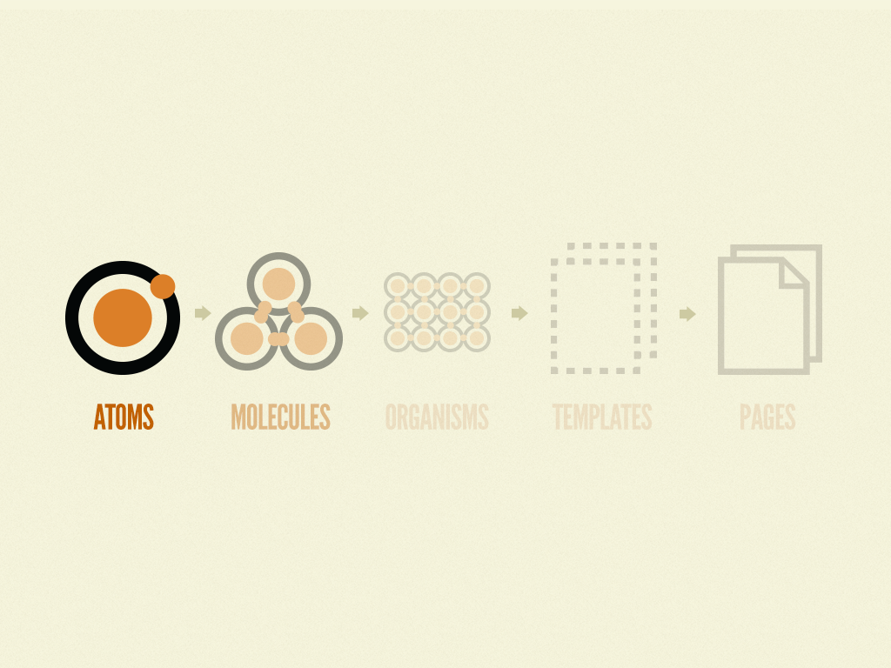

Atomic design är en metodik för att skapa och hantera designsystem. Den delar upp gränssnittskomponenter i fem distinkta nivåer: atomer, molekyler, organismer, mallar och sidor. Denna approach hjälper till att skapa mer konsekventa och skalbara designsystem, vilket är särskilt användbart när man arbetar med flexibla CMS-plattformar som Storyblok. Genom att tänka i termer av atomic design kan vi skapa mer modulära och återanvändbara komponenter i Storyblok, vilket underlättar för både utvecklare och innehållsskapare.

Läs mer https://atomicdesign.bradfrost.com/chapter-2/

## Hur vill redaktörerna jobba och vad för möjligheter skall de få?

När vi utvecklare sitter och jobbar Storyblok så är det viktigt att ev lägga till mer funktionalitet 
i en komponent än vad design kräver.    Det kan ex vara möjlighet att välja bakgrundsfärg
eller till och med ändra vilken flex layout dom ska ha.

**Hero komponent**

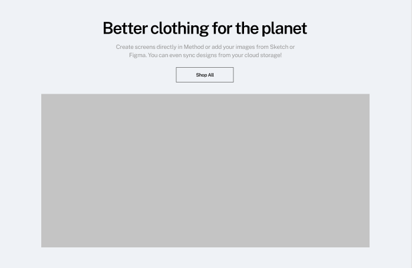

- title (text)
- text (textarea eller richtext)
- button (blocks typ som i sin tur  kan info andra komponenter som button)
- image (asset)
- text-alignment (dropdown med left, center, right)

**Button komponent**

- label (text)
- buttonBgColor (text, datasource, list)
- size  (dropdown med fördefinerade val)

## Uppgift 1 (30 min)

Skapa storyblok konto och erat första space.

https://www.storyblok.com/

1. Skapa konto 
2. Skapa erat första space
3. Skapa minst två nya block som vid namn till Hero och button (skall innehåll fälten enligt bild nedan)
4. Lägg till blocket i en sida/entry med innehåll.
5. Undersök draft.json


---

## Uppgift 2 - Hämta alla stories (30 min)

Vårt första api call mot Storyblok.

1. **Hämta en API-nyckel**: Från ditt "space".  (Settings > Access tokens) 
2. Använd fetch API.
3. Exempel nedan
    
    ```jsx
    const token = 'din_prewiew_token'; // Ersätt med din preview API-token
    
    fetch(`https://api.storyblok.com/v2/cdn/stories?version=published&token=${token}`)
      .then(response => response.json())
      .then(data => {
        console.log('Storyblok-svar:', data);
      })
      .catch(error => {
        console.error('Fel vid hämtning från Storyblok:', error);
      });
    
    ```
    

1. **Konfigurera API-anropet**:
    - **Endpoint**: Använd Storybloks CDN API-endpoint.
    - **Parametrar**: Inkludera `version` och `token` som query-parametrar. `version` kan vara `draft` eller `published`, beroende på om du vill hämta utkast eller publicerat innehåll.
2. **Hantering av svar**: Använd `.then()` för att hantera det lyckade svaret och `.catch()` för att hantera eventuella fel. Ni får använda async/await också.
3. Logga ut i responsen i console och studera alla stories, vad ser du?.

## Uppgift 3 - Hämta en story (30 min)

1. Hämta en specifik story från ditt space.
2. Rita ut svaret i DOM:en.   Se till att rita ut innehållet minst från komponenten Hero med en matchande utseende (Image, h1, p element). Desto fler komponenter desto bättre.
3. Gör nu så att **storySlug** går att ändra direkt via ett inputfält och knapp  för att testa olika storys, resultat blir att din frontend ändras

### Exempel: Hämta en specifik story

```jsx
const storySlug = 'din_berättelse_slug'; // Ersätt med din story slug
const token = ''; 

fetch(`https://api.storyblok.com/v2/cdn/stories/${storySlug}?version=published&token=${token}`)
  .then(response => response.json())
  .then(data => {
    console.log('Storyblok-svar:', data);
  })
  .catch(error => {
    console.error('Fel vid hämtning från Storyblok:', error);
  });
```

---

## Lösning till JS uppgifterna

```jsx
const TOKEN = "QQgsdTLaAikhKDBN800tTgtt"; // Ersätt med din publika API-token
const STORYBLOK_API_URL = "https://api.storyblok.com/v2/cdn/";
const LINK_URL = "links"
const STORIES_URL = "stories";
const VERSION = "draft";

const getStoryUrl = (slug = "") => {
  return `${STORYBLOK_API_URL}${STORIES_URL}${slug}?version=${VERSION}&token=${TOKEN}`;
};

const getLinksUrl = (slug = "") => {
  return `${STORYBLOK_API_URL}${LINK_URL}${slug}?version=${VERSION}&token=${TOKEN}`;
}

const getStories = async () => {
  fetch(getStoryUrl())
    .then((response) => response.json())
    .then((data) => {
      console.log("Storyblok-svar:", data);
    })
    .catch((error) => {
      console.error("Fel vid hämtning från Storyblok:", error);
    });
};

const getStory = async (slug) => {
  return fetch(getStoryUrl(`/${slug}`))
    .then((response) => response.json())
    .then((data) => {
      console.log("Storyblok-svar:", data);
      return data.story;
    })
    .catch((error) => {
      console.error("Fel vid hämtning från Storyblok:", error);
    });
};

const renderBodyComponents = (body) => {
  body.forEach((component) => {
    switch (component.component) {
      case "hero":
        renderHeroComponent(component);
        break;
      case "teaser":
        renderTeaser(component);
        break;

			case "button"
				renderButton(component)
      default:
        console.error("Komponenten saknas:", component.component);
        return;
    }
  });
};

const renderHeroComponent = (data) => {
  const imageText = document.createElement("div");
  imageText.innerHTML = `
  <p>${data.title}</p>
    <p>${data.body}   hero</p>`;
  document.querySelector("#content").appendChild(imageText);
};

const renderTeaser = (data) => {
  const teaser = document.createElement("div");
  teaser.innerHTML = `<h1>${data.headline}</h2>`;
  document.querySelector("#content").appendChild(teaser);
};

document.getElementById("search").addEventListener("click", async () => {
  const content = document.querySelector("#content");
  try {
    content.innerHTML = ""
    const slug = document.getElementById("slugInput").value;
    const currentStory = await getStory(slug);
    renderBodyComponents(currentStory.content.body);
  } catch (error) {
    console.error("Fel vid hämtning av story:", error);
    content.innerHTML = "<h2>Kunde inte hitta storyn</h2>";
  }
});

```

## Uppgift 4 - Skapa fler komponenter enligt exempel i Storyblok

Skapa flertal komponenter baserat på exempel nedan.  Det är upp till er och bygga själva strukturen.   Tänk på att det ska vara tydligt och lätt att använda för en redaktör samtidigt som det skall vara smidigt för oss och bygga mot frontend mot.  

**HeroWTextImage**

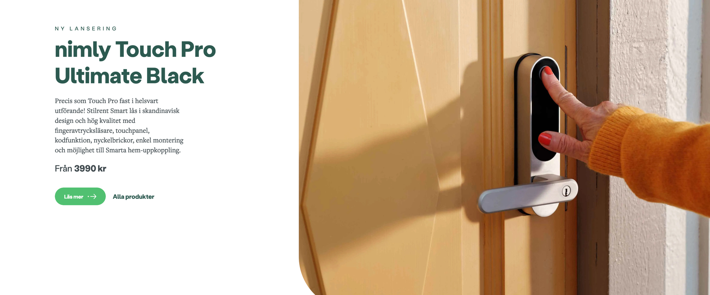

**GridWProductItems**

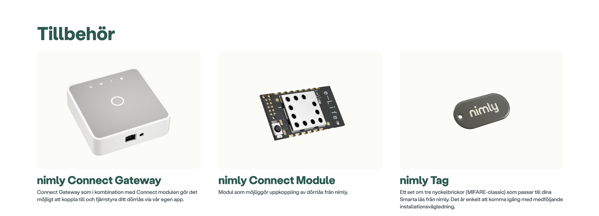

Tips:  Använd dropdown fält som i sin tur använder product item komponent

**HeadingWTextImage**

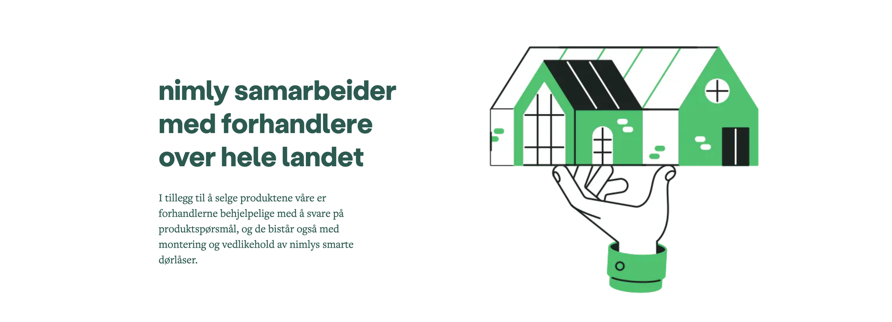

# Vad har vi lärt oss?

I dagens lektion har vi lärt oss om Storyblok, en flexibel headless CMS. Vi har utforskat dess funktioner som Stories datastruktur, Content/Blocks, Visual editor och Content system. Dessutom har vi skapat vårt första Storyblok space, byggt komponenter och gjort API-anrop för att hämta innehåll.

# Har vi tid över så pratar jag lite Nextjs

# Tills nästa vecka

Målet är att bilda en hyfsad uppfattning om nextjs och storyblok inför nästa vecka.
Jag kommer gå igenom detta vid nästa lektion och svara på ev funderingar.

1. **Next.js**
Antingen kolla genom video eller följ dokumentation.
https://youtu.be/h2BcitZPMn4
2. **Storyblok intro  & Next.js**
Så gott ni kan följ denna:  

https://www.storyblok.com/tp/add-a-headless-cms-to-next-js-13-in-5-minutes

**Docs:**

https://www.storyblok.com/docs/api/management/core-resources/stories/the-story-object

https://www.storyblok.com/docs/home/introduction

https://www.storyblok.com/tutorials