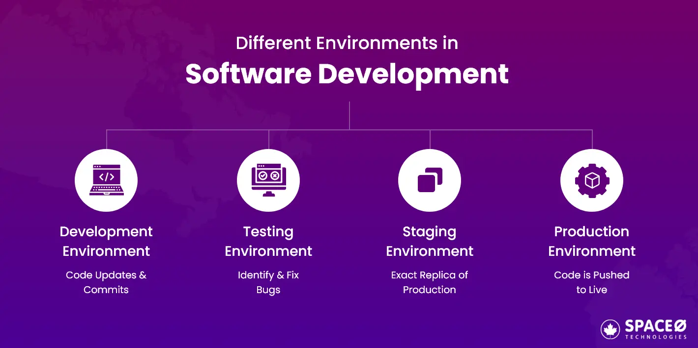

### Olika typer av miljöer inom utveckling

För att säkerställa en stabil och välfungerande programvara används olika miljöer genom utvecklingsprocessen. Dessa miljöer hjälper till att strukturera utvecklingsarbetet och minimera risken för fel i den färdiga produkten.

1. **Utvecklingsmiljö (Development Environment)**
    
    Detta är där utvecklare skriver och testar sin kod. Alla ändringar sker här innan koden flyttas vidare. Utvecklarna använder verktyg som **integrerade utvecklingsmiljöer (IDEs)** och **versionshanteringssystem** för att hantera koden.
    
    *Exempel:* En utvecklare skriver ny kod i **Visual Studio Code** och testar den genom att köra en **lokal Node.js-server**.
    
2. **Testmiljö (Testing Environment)**
    
    När koden är utvecklad flyttas den till en testmiljö där den genomgår olika tester, som **enhetstester och integrationstester**. Syftet är att identifiera och åtgärda buggar innan koden går vidare. Testmiljön försöker efterlikna produktionsmiljön så mycket som möjligt.
    
    *Exempel:* Ett team kör automatiserade **Jest-enhetstester** på koden i en testmiljö innan den godkänns för vidare distribution.
    
3. **Stagingmiljö (Staging Environment)**
    
    Stagingmiljön fungerar som en förhandsgranskning av produktionen. Här görs sluttester i en miljö som liknar den faktiska produktionsmiljön. Målet är att identifiera eventuella problem innan en ny version lanseras.
    
    *Exempel:* En ny version av en webbapplikation distribueras till en **stagingserver** där teamet testar funktionaliteten innan lansering.
    
4. **Produktionsmiljö (Production Environment)**
    
    Detta är den slutliga och skarpa miljön där koden används av slutanvändare. Här måste systemet vara stabilt, presterande och pålitligt, eftersom eventuella fel kan påverka riktiga användare.
    
    *Exempel:* En e-handelsplattform körs på **AWS**, där kunder gör riktiga köp och hanterar sina ordrar i realtid.
    

---