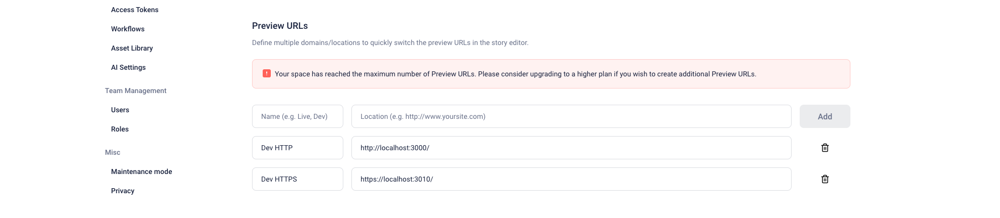

# Dagens agenda

- Hur har det gått med uppgifterna?
- Snabbt om CMS
- Nextjs introduktion + funderingar
- Uppgifter

# Hur har det gått?

# Snabb sammanfattning CMS

### **Vad är ett CMS?**

Ett **Content Management System (CMS)** är en mjukvara som hjälper användare att skapa, hantera och redigera digitalt innehåll på en webbplats utan djupgående kunskaper i kodning. Det möjliggör enkelt hantering av texter, bilder, videor och andra mediafiler samt hantering av användarroller och behörigheter.

### **Funktioner i ett CMS:**

1. **Innehållshantering**: Skapa, redigera och publicera innehåll enkelt.
2. **Användarhantering**: Stöd för olika användarroller och behörigheter.
3. **Teman och design**: Anpassa webbplatsens utseende utan kodning.
4. **Plugins och tillägg**: Utöka funktionaliteten med extra verktyg för t.ex. SEO, e-handel och sociala medier.
5. **SEO-verktyg**: Förbättra webbplatsens sökmotorrankning.
6. **Mediehantering**: Hantera uppladdning och visning av bilder och videor.

### **Ursprung och utveckling**

- **1980-talet**: De första interna CMS utvecklades inom stora företag.
- **1990-talet**: Kommersiella CMS lanserades för att hantera växande behov av webbinnehåll.
- **2000-talet och framåt**: Öppna källkodsprojekt som WordPress, Joomla och Drupal blev tillgängliga, vilket gjorde CMS mer tillgängliga för alla typer av användare.

### **Populära CMS-plattformar**

- **WordPress**: Enkel att använda, idealisk för bloggar och små företag.
- **Joomla och Drupal**: Mer robusta, används för större och komplexa webbplatser.
- **Magento och Shopify**: Specialiserade på e-handel.
- **Wix och Webflow**: Drag-and-drop-verktyg, idealiska för nybörjare och små företag.
- **Storyblok**: Ett headless CMS för modern webbapplikationsutveckling.

### **Fördelar med CMS**

1. **Tidsbesparande**: Uppdateringar kan göras snabbt utan utvecklare.
2. **Kostnadseffektiv**: Minskar behovet av externa utvecklartjänster.
3. **Säkerhet**: Inbyggda säkerhetsfunktioner och regelbundna uppdateringar.

### **Användningsområden**

- **Bloggar**: Hantera och publicera bloggposter.
- **E-handel**: Driva onlinebutiker med specialfunktioner.
- **Företagswebbplatser**: Hålla företagsinformation uppdaterad och relevant.

### **Headless vs Traditionellt CMS**

- **Headless CMS**: Separat backend och frontend; innehållet levereras via API till olika plattformar.
- **Traditionellt CMS**: Backend och frontend är integrerade; enklare hantering och visning av innehåll.

### **Att välja rätt CMS**

1. **Användarvänlighet**: Anpassat efter användarnas tekniska nivå.
2. **Flexibilitet och skalbarhet**: Möjlighet att växa och anpassa webbplatsen.
3. **SEO-funktioner**: Stöd för optimering för sökmotorer.
4. **Säkerhet**: Regelbundna uppdateringar och inbyggda skydd.
5. **Kostnad**: Initial och långsiktig kostnadseffektivitet.
6. **Support och community**: Tillgång till support och resurser.
7. **Integrationer**: Möjlighet att koppla till andra system och verktyg.
8. **Framtidssäkerhet**: Aktiv utveckling och anpassningsmöjligheter.

---


# Nextjs

Next.js är ett kraftfullt fullstack ramverk byggt ovanpå React, designat för att skapa högpresterande webbapplikationer med server-side rendering (SSR) och statisk sajtgenerering (SSG). Utvecklat av Vercel, Next.js gör det enkelt att skapa skalbara och SEO-vänliga applikationer med minimal konfiguration.

### Nyckelfunktioner i Next.js

1. **Server-side Rendering (SSR)**:
Med SSR renderas dina React-komponenter på servern, vilket innebär att en fullt renderad HTML-sida skickas till klienten. Detta kan förbättra både prestanda och SEO, eftersom sökmotorer kan indexera den server-renderade HTML-koden.
2. **Static Site Generation (SSG)**:
Next.js erbjuder också statisk sajtgenerering, vilket innebär att HTML-sidor genereras vid bygget och återanvänds vid varje begäran. Detta är idealiskt för innehåll som inte förändras ofta, eftersom det resulterar i snabbare sidladdningar och bättre prestanda.
3. **API Routes**:
Next.js inkluderar stöd för att bygga API-endpoints direkt i ditt projekt. Detta gör det möjligt att hantera både frontend och backend inom samma applikation, vilket förenklar utvecklingsprocessen.
4. **Dynamic Routing**:
Med dynamisk routing kan du skapa flexibla och dynamiska URL-strukturer utan att behöva konfigurera en router manuellt. Next.js använder filstrukturen i ditt projekt för att definiera routes.
5. **Bildoptimering**:
Inbyggd bildoptimering gör det enkelt att automatiskt optimera och skala bilder för olika enheter och skärmar, vilket förbättrar laddningstider och användarupplevelse.
6. **CSS och Sass-stöd**:
Next.js stöder CSS-moduler vilket gör det enkelt att använda modern styling i dina applikationer.  Går att använda tredjeparts css frameworks som Tailwind.

## Pages Router

`Pages Router` är det traditionella sättet att hantera routing i Next.js. Det baseras på filsystemet och är väldigt enkelt att använda:

1. **Filstruktur**:
    - Varje fil i mappen `pages` representerar en enskild ruta (eller sida) i applikationen.
    - Filnamnet motsvarar URL-path. Till exempel, `pages/index.js` motsvarar rot-URL (`/`), och `pages/about.js` motsvarar URL`/about`.
2. **Dynamic Routes**:
    - Du kan skapa dynamiska rutter genom att använda hakparenteser i filnamn. Till exempel, `pages/post/[id].js` kommer att matcha rutter som `/post/1`, `/post/2`, och så vidare.
3. **API Routes**:
    - Next.js stödjer även att skapa API-rutter inom `pages/api` katalogen. Varje fil i denna katalog blir en slutpunkt för en API-rutt.
4. **Automatic Code Splitting**:
    - Varje sida (fil) är automatiskt klyvd (split) i sin egen bundle, vilket innebär att endast den nödvändiga koden laddas när en viss sida besöks.

## App Router (Denna skall vi använda)

`App Router` är en nyare routingmetod som introducerades med Next.js 13 och erbjuder mer avancerade funktioner samt en mer flexibel struktur:

1. **Filstruktur**:
    - `App Router` använder en mappstruktur där varje mapp kan ha sin egen layout, error, loading, och andra speciella filer som definierar olika aspekter av sidans beteende.
    - Huvudmappen för `App Router` är `app` istället för `pages`.
2. **Server Components**:
    - Med `App Router` kan du använda React Server Components, vilket gör det möjligt att rendera komponenter på servern och skicka den färdiga HTMLtill klienten.
3. **Layouts**:
    - Layouts kan delas över flera sidor. En layout definieras med en `layout.js` fil inom en mapp och kan användas av alla undersidor inom samma mapp.
4. **Loading UI**:
    - Loading-states kan definieras med en `loading.js` fil inom en ruttmapp, vilket gör det möjligt att visa en laddningsindikator medan sidan laddas.
5. **Error Handling**:
    - Errors kan hanteras med en `error.js` fil inom en ruttmapp, vilket gör det möjligt att visa anpassade felmeddelanden för specifika rutter.
6. **Collocation**:
    - All relaterad kod (t.ex. komponenter, styles, test) kan placeras inom samma mappstruktur, vilket gör koden mer organiserad och lättare att hantera.

### Server Components

Server Components är en ny funktion i React som tillåter komponenter att renderas på servern och skickas som HTML till klienten. Detta kan förbättra prestandan eftersom mindre JavaScript skickas till klienten.

```jsx
// app/page.js
export default async function HomePage() {
  const data = await fetchData(); // Hämta data på servern

  return (
    <div>
      <h1>Welcome to Next.js App Router</h1>
      <p>{data.message}</p>
    </div>
  );
}

async function fetchData() {
  return { message: 'Hello from the server!' };
}

```

I detta exempel hämtas data på servern inom komponenten `HomePage`. Komponentens HTML renderas på servern och skickas till klienten.

### Route Segments

Route segments är delar av URL-strukturen som mappas till mappar i `app`-katalogen. Med route segments kan du skapa dynamiska rutter och nested rutter på ett intuitivt sätt.

### Exempel: Dynamiska Rutter och Nested Rutter

```jsx
// app/blog/[slug]/page.js
export default async function BlogPost({ params }) {
  const { slug } = params;
  const post = await fetchPost(slug); // Hämta inlägget baserat på slug

  return (
    <div>
      <h1>{post.title}</h1>
      <p>{post.content}</p>
    </div>
  );
}

async function fetchPost(slug) {
  // Simulerad datahämtning
  return { title: `Blog Post ${slug}`, content: `Content for post ${slug}` };
}

```

I detta exempel skapas en dynamisk rutt för blogginlägg där `slug` är en parameter. Mappen `[slug]` gör att vi kan matcha alla URL

som

```
/blog/some-post
```

.

### Layouts

En annan kraftfull funktion i `App Router` är möjligheten att definiera delade layouts som kan användas över flera sidor.

### Exempel: Layout

```jsx

// app/layout.js
export default function RootLayout({ children }) {
  return (
    <html>
      <head>
        <title>My Next.js App</title>
      </head>
      <body>
        <header>
          <h1>My App</h1>
        </header>
        <main>{children}</main>
        <footer>
          <p>© 2024 My App</p>
        </footer>
      </body>
    </html>
  );
}

```

Med `RootLayout` kan du definiera en grundläggande layout som används för alla sidor. Innehållet för varje sida kommer att renderas inom `<main>{children}</main>`.

### Loading och Error States

Med `App Router` kan du också hantera laddning och fel på ett mer granularit sätt.

### Exempel: Loading State

```jsx
// app/loading.js
export default function Loading() {
  return <p>Loading...</p>;
}

```

### Exempel: Error Handling

```jsx
// app/error.js
export default function Error({ error }) {
  return (
    <div>
      <h1>Something went wrong!</h1>
      <p>{error.message}</p>
    </div>
  );
}
```

### Filstruktur

```css

app
├── layout.js
├── loading.js
├── error.js
├── page.js
└── blog
    └── [slug]
        └── page.js

```

## Klientkomponenter (Client Components)

**Kännetecken:**

1. **Interaktivitet:** Eftersom de körs på klienten (webbläsaren) kan de hantera användarinteraktioner som klick, händelser och dynamiska UI-uppdateringar.
2. **State Management:** De kan använda React state och hooks som `useState`, `useEffect`, `useContext` etc.
3. **Initial Render:** De renderas initialt på servern, men en del av koden skickas till klienten och exekveras där för att möjliggöra interaktivitet.
4. **Bundling:** Klientkomponenter inkluderas i den slutliga JavaScript-bundlen som skickas till webbläsaren.

**Syntax:**
`use client` överst i filen:

```jsx

'use client';

import React, { useState, useEffect } from 'react';

function ClientComponent() {
  const [count, setCount] = useState(0);

  useEffect(() => {
    // Side-effect logic here
  }, []);

  return (
    <button onClick={() => setCount(count + 1)}>
      Clicked {count} times
    </button>
  );
}

export default ClientComponent;

```

## Serverkomponenter (Server Components)

**Kännetecken:**

1. **Prestanda:** Eftersom de renderas på servern och skickar färdig HTML till klienten, minskar den initiala belastningen på klientens JavaScript. Detta kan förbättra sidans laddningstider.
2. **Ingen Interaktivitet:** De kan inte hantera användarinteraktioner direkt. Ingen React state eller hooks som `useState` eller `useEffect` kan användas.
3. **Data Fetching:** Serverkomponenter kan utföra datahämtning direkt på servern, vilket kan resultera i snabbare och mer effektiv datarendering.
4. **Isolering:** De är isolerade från klientens JavaScript-bundle och skickar bara HTML till klienten.

**Syntax:**
Ingen särskild kommentar behövs för att indikera att en komponent är en serverkomponent. Det är standardläget om `use client`-kommentaren inte används.

```jsx

import React from 'react';
import fetchData from './fetchData';

async function ServerComponent() {
  const data = await fetchData();

  return (
    <div>
      <h1>Data fetched from server</h1>
      <pre>{JSON.stringify(data, null, 2)}</pre>
    </div>
  );
}

export default ServerComponent;

```

**Klientkomponenter:**

- Används för interaktiva och dynamiska delar av användargränssnittet.
- Kan använda React state och hooks.
- Körs i webbläsaren.
- Märks med `use client`kommentaren.

**Serverkomponenter:**

- Används för statisk eller nästan statisk renderingslogik.
- Kan inte använda React state eller hooks.
- Körs på servern och skickar endast HTML till klienten.
- Ingen speciell märkning krävs.

## Deployment med Vercel CLI

Vercel CLI är ett kommandoradsverktyg som används för att hantera och distribuera projekt på Vercel-plattformen.

### **Huvudfunktioner:**

1. **Distribuera projekt:** Med kommandot **`vercel`** kan vi utvecklare snabbt distribuera sina projekt till Vercel-plattformen. Detta inkluderar både statiska och dynamiska webbplatser.
2. **Förhandsgranskning:** Kommandot **`vercel dev`** startar en lokal utvecklingsserver som speglar produktionsmiljön på Vercel, vilket gör det enkelt att testa ändringar innan de distribueras
3. **Hantera projekt:** Utvecklare kan använda Vercel CLI för att skapa, radera och hantera projekt direkt från kommandoraden.
4. **Miljövariabler:** Med Vercel CLI kan utvecklare enkelt ställa in och hantera miljövariabler som används i deras applikationer.
5. **Loggning och felsökning:** CLI-verktyget erbjuder också möjligheter att se distributionsloggar och felsöka problem direkt från terminalen.

### **Användning:**

- **Installation:** För att installera Vercel CLI, kör kommandot **`npm install -g vercel`**.
- **Initialisering av projekt:** När ett projekt är klart för distribution, kan man köra **`vercel`** i projektets rotmapp för att påbörja distributionsprocessen.
- Deployment: vercel —prod
- Preview deployment: vercel

# Viktiga komponenter

### 1. `Link` Komponent

`Link`-komponenten i Next.js används för att skapa navigering mellan olika sidor i applikationen. Den är liknande HTML's `<a>`-tagg, men med flera optimeringar som gör den bättre anpassad för moderna Single Page Applications (SPA).

**Varför använda `Link` i stället för `<a>`?**

- **Clientside navigering:** Next.js `Link` hanterar navigering på klientsidan, vilket innebär att sidorna laddas snabbare utan att hela sidan behöver laddas om.
- **Förladdning av sidor:** När en `Link`komponent visas på skärmen börjar Next.js automatiskt att förladda resurserna för målsidan i bakgrunden, vilket ytterligare snabbar upp navigeringen.

**Exempel på användning av `Link`:**

```jsx

import Link from 'next/link';

function HomePage() {
  return (
    <div>
      <h1>Välkommen till startsidan</h1>
      <Link href="/about">
        <a>Gå till Om Oss sidan</a>
      </Link>
    </div>
  );
}

export default HomePage;

```

**Förklaring:**

- `Link` används för att omdirigera användaren till "/about" sidan när de klickar på länken.
- Notera att `<a>`taggen fortfarande används inuti `Link` för att bibehålla det semantiska innehållet och för att underlätta stilisering.

### 2. `Image` Komponent

`Image`-komponenten i Next.js är ett kraftfullt verktyg för att optimera bilder på din webbplats. Den är designad för att ladda bilder på ett effektivt sätt, vilket förbättrar både sidans prestanda och SEO.

**Fördelar med att använda `Image`:**

- **Automatisk optimering:** `Image`komponenten optimerar automatiskt bilder genom att leverera rätt bildstorlek baserat på användarens skärmstorlek och upplösning.
- **Lazy Loading:** Bilder laddas inte förrän de är nära att bli synliga på skärmen, vilket minskar initial laddningstid och sparar bandbredd.
- **Responsive design:** Med `Image` kan du enkelt skapa bilder som anpassar sig till olika skärmstorlekar utan att behöva manuellt hantera olika bildstorlekar.

**Exempel på användning av `Image`:**

```jsx

import Image from 'next/image';

function ProfilePage() {
  return (
    <div>
      <h1>Min Profil</h1>
      <Image
        src="/me.jpg"
        alt="Bild av mig"
        width={500}
        height={500}
      />
    </div>
  );
}

export default ProfilePage;

```

**Förklaring:**

- `src`attributet pekar på bilden som ska visas. Bilden kan vara en lokal fil eller en extern URL.
- `width` och `height` anger bildens dimensioner, vilket är viktigt för att Next.js ska kunna reservera rätt plats för bilden innan den laddas in.
- `alt` är en textbeskrivning av bilden, vilket är viktigt för tillgänglighet och SEO.

# Funderingar?

Har ni stött på patrull?

# Cachning

Några av er säkert märkt att nextjs cachar datat.  Vi måste alltid opta ut från en cachning via
att sätta cache:no-store, eller unstableCache.

# Nextjs demo

Jag visar och förklarar..

# Storyblok med nextjs demo

jag visar och förklarar

# Hantera och aktivera visual editor



För att få visual editorn och fungera med utvecklingsmiljön så måste man göra följande:

- Lägga till dev url i Settings
- Enable SSL för [localhost](http://localhost) för att köra HTTPS.

# Blok

Varje komponent som är kopplad i vår kod får ett så kallat blok objekt. 
Detta representerar datat från och schemat vi har byggt upp i Storyblok.

```jsx
export default function Hero({ blok }) {
  return <section>
    <h1>{blok.headline}</h1>
    <p>{blok.desc}</p>
  </section>
}   
```

## **StoryblokEditable**

För att vi ska få dynamiken i visual editorn så är det viktigt att importera **storyBlokEditable**  från storyblok paketet och skicka in  blok prop till föräldern, enligt följande:

```jsx
import { storyblokEditable } from "@storyblok/react/rsc";

export default function Hero({ blok }) {
  return <section {...storyblokEditable(blok)}>
    <h1>{blok.headline}</h1>
    <p>{blok.desc}</p>
  </section>
}   

```

Utan detta så försvinner dynamiken i visual editorn.  Måste existera för att storyblok

skall kunna göra sin magi för att styra innehållet i realtid.

## Uppgift 1  - Next.js  med Storyblok

Vi utgår från att använda erat första storyblok space från förra veckan.

Se till att startsidan har innehåll.

1. **Installera Next.js 13+:**
    
    ```bash
    
    npx create-next-app@latest webb23-storyblok
    cd webb23-storyblok
    ```
    
2. **Starta utvecklingsservern:**
    
    ```bash
    
    npm run dev
    ```
    
    Öppna webbläsaren och navigera till `http://localhost:3000`
    
3. **Installera Storyblok SDK:**
    
    ```bash
    
    npm install @storyblok/react
    
    ```
    
4. **Koppla ditt Storyblok Space:**
    - Logga in på ditt Storyblok-konto.
    - Ta din Preview API-key från "Settings" > "API-Keys".
5. **Skapa en “StoryblokProvider.jsx” komponent och lägg in token:**

    
    ```jsx
    import Teaser from "@/components/Teaser";
    import { storyblokInit } from "@storyblok/react"
    
    const components = {
        // Define your components here
        "teaser": Teaser
    }
    
    storyblokInit({
        accessToken: "token",
        use: [apiPlugin],
        components
    });
    
    export default function StoryblokProvider({ children }) {
        return (
            children
        )
    }
    ```
    
6. **Importera “StoryblokProvider” komponent samt lägg in storyblokInit till app/layout.js**
    
    ```jsx
    import StoryblokProvider from "@/provider/StoryBlokProvider";
    
    storyblokInit({
      accessToken: "token",
      use: [apiPlugin],
    });
    
    export default function RootLayout({ children }) {
      return (
        <StoryblokProvider>
          <html lang="en">
            <body >{children}</body>
          </html>
        </StoryblokProvider>
      );
    }
    
    ```
    
7. **Skapa en eller använd befintlig fil `app/page.js`:**
    
    ```jsx
    import { getStoryblokApi, useStoryblokApi } from "@storyblok/react/rsc";
    import StoryblokStory from "@storyblok/react/story";
    
    async function getStory(slug){
        const storyUrl = "cdn/stories/" + slug;
        const { data } = await getStoryblokApi().get(
          storyUrl,
    		  {
    	      version: "draft",
    	      resolve_links: "url",
    	      cv: Date.now(),
    	    };
        );
        return data.story;
    }
    
    export default async function Home() {
    	 const currentStory = await getStory("home")
      return (
        <main>
         <StoryblokStory story={currentStory} />
        </main>
      );
    }
    
    ```
    
8. **Navigera till `http://localhost:3000`**att se innehållet från Storyblok.
9. Lägg till ny komponent i Storyblok provider och undersök blok prop.
    
    ```jsx
    export default function Component({ blok }) {
        return (
            <section className="w-full bg-red">
                <h1>{blok.headline}</h1>
                <p>{blok?.desc}</p>
            </section>
        )
    }
    ```
    

## Uppgift 2  -  Skapa en dynamisk route

Se till att skapa en ny sida i storyblok

1. Skapa nytt route segment [slug] (ny folder under app)
2. Skapa page.js i slug foldern
    
    ```jsx
    export default async function CMSPage({ params }) {
      try {
        const currentStory = await getSomethingHere(params)
        if (!currentStory) throw new Error();
    
        return <StoryblokStory story={currentStory} />;
      } catch (error) {
        console.log("error", error)
        notFound();
      }
    ```
    
3. Hämta en story baserat på params
4. **Navigera till  specifik slug`http://localhost:3000`**att se innehållet från Storyblok. 

## Uppgift 3  -  Deploy med vercel

- **Installation:** För att installera Vercel CLI, kör kommandot **`npm install -g vercel`**.
- **Initialisering av projekt:** När ett projekt är klart för distribution, kan man köra **`vercel`** i projektets rotmapp för att påbörja distributionsprocessen.
- Deployment: vercel —prod
- Preview deployment: vercel

1. Skapa konto hos vercel
2. Installera Vercel CLI
3. I terminalen skriv vercel och följ instruktionerna
4. Slutligen skriv vercel —prod

## Uppgift 4  -  Länka din deployade staging

- **Installation:** För att installera Vercel CLI, kör kommandot **`npm install -g vercel`**.
- **Initialisering av projekt:** När ett projekt är klart för distribution, kan man köra **`vercel`** i projektets rotmapp för att påbörja distributionsprocessen.
- Deployment: vercel —prod
- Preview deployment: vercel

1. Skapa konto hos vercel
2. Installera Vercel CLI
3. I terminalen skriv vercel och följ instruktionerna
4. Slutligen skriv vercel —prod