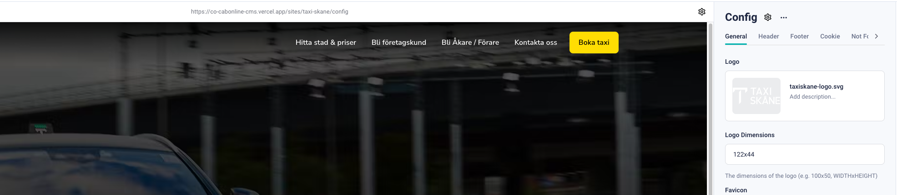
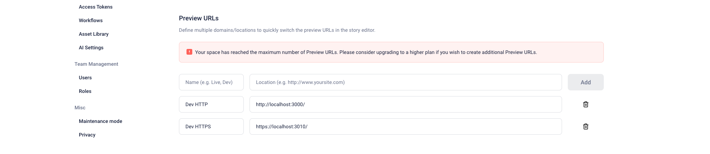
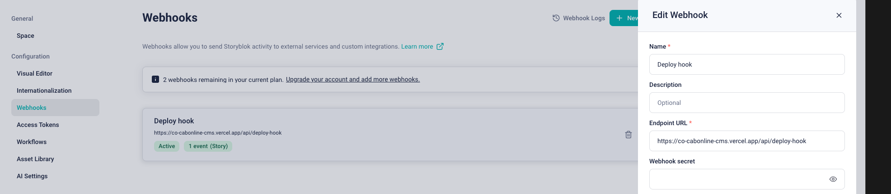

# Dagens agenda

- Rep från igår och ev funderingar
- Arbeta med storyblok i nextjs miljö
- Gå genom boilerplate
- Inviduell uppgift (betygsgrundande)

# Reptition

- Storyblok
- Hur vi sätter upp ett repo
- Förklaringar

## Hantering av dynamiska sidor

Renderas på servern och skickas till klienten

```jsx
import StoryblokStory from "@storyblok/react/story";
import { CMS } from "@/utils/cms";
import { notFound } from "next/navigation";

export default async function CMSPage({ params }) {
  try {
    const { story } = await CMS.getStory(params);
    return <StoryblokStory story={story} />;
  } catch (error) {
    notFound();
  }
}

```

### Hantering av statiska sidor

Genereras i förväg vid varje build.

- Hämta alla länkar från cdn/links
- Hämta metadata för sidan (SEO)
- Hämta siddata

```jsx

import { useStoryblokState, getStoryblokApi, StoryblokComponent } from "@storyblok/react";

export async function generateStaticParams() {
  const storyblokApi = getStoryblokApi();
  const { data } = await storyblokApi.get('cdn/links/');

  return Object.keys(data.links).map((slug) => ({
    slug: data.links[slug].slug,
  }));
}

export async function generateMetadata({ params }) {
  const storyblokApi = getStoryblokApi();
  const { data } = await storyblokApi.get(`cdn/stories/${params.slug}`);
  return { title: data.story.name };
}

export default async function Page({ params }) {
  const storyblokApi = getStoryblokApi();
  let { data } = await storyblokApi.get(`cdn/stories/${params.slug}`);
  data = useStoryblokState(data);

  return (
    <main>
      <StoryblokComponent blok={data.story.content} />
    </main>
  );
}

```

## Links API

Storyblok erbjuder att API som returnerar samtliga paths inom ett storyblok space.
Detta använder vi när vi skall generera en statisk site iförväg.

# Exempel på hur vi kan skriva vår CMS i en klass

```jsx
import { getStoryblokApi, useStoryblokApi } from "@storyblok/react/rsc";

export class CMS {
  static async sbGet(path, params) {
    return getStoryblokApi().get(path, params);
  }

  static async getStory(params) {
    if(!params) return {};
    const uri = params?.slug?.join("/");
    const {data} = await useStoryblokApi().get("cdn/stories/home", this.getDefaultSBParams());
    return data.story;
  }

  static getDefaultSBParams() {
    return {
      version: "draft",
      resolve_links: "url",
      cv: Date.now(),
    };
  }

  static async getStaticPaths() {}
}

```

# Hantering av en generisk sida (Page)

Vi kan komplettera den befintliga Page content-type blocket med flertal SEO fält.
Därefter har vi vår Page komponent i koden som då ansluter och ritar ut önskat innehåller baserat på datat.

Visar hur StoryblokComponent tar in blok som prop och på sätt renderar ut korrekt komponent. (Komponenten måste vara inlagd i vår provider)

```jsx
import { StoryblokComponent } from "@storyblok/react"

export default function Page({ blok }) {
  return (
    <main>
      {blok.body.map((blok) => (
        <StoryblokComponent blok={blok} key={blok._uid} />
      ))}
    </main>
  )
}
```

# Hantering utav globala komponenter (Config)



Genom att skapa en ny content-typ block “Config” kan vi skapa vårt schema för de globala komponenterna för hela webbplatsen. Dessa komponenter kan vara logotyp, header navigation, footer navigation, cookiehantering och 404-sida.  

```jsx
export default function Header({ blok }) {
	const { header_links } = blok
	return (
		<header>
			{header_links.map((link) => (
				<Link key={link._uid} href={link.link.url}>{link.link.text}</Link/>
			)
			)}
		</header>
	)
}
```

# Hantera och aktivera visual editor



För att få visual editorn och fungera med utvecklingsmiljön så måste man göra följande:

- Lägga till dev url i Settings
- Enable SSL för [localhost](http://localhost) för att köra HTTPS.

# Webhooks & Deploy hooks



Via Settings > Webhooks så kan vi sätta så kallade deploy hooks, där vi kan välja

att till exempel vid en publicering i CMS:et bygga om våran produktionsmiljö.
Vi tar då alltså webhooken från vercel och klistrar in det i Storyblok.

# Vercel

Hur ska vi deploya? Jag visar.

```jsx
//För att generera preview miljö
vercel
//För att generera produktionsmiljö
vercel --prod
//Hämta env variabler från vercel
vercel env pull
```

# Koppla komponenter via provider

```jsx
"use client";

import { storyblokInit, apiPlugin } from "@storyblok/react/rsc";

import Hero from "@/cms-components/Hero";

const components = {
  Hero
}

storyblokInit({
  accessToken: process.env.NEXT_PREVIEW_STORYBLOK_TOKEN,

  use: [apiPlugin],
  components
});

export default function StoryblokProvider({ children }) {
  return (
    children
  );
}
```

**Se till att vår provider wrappar layout.js**

```jsx
import "./globals.css";
import StoryblokProvider from "@/providers/StoryblokProvider";
import { storyblokInit, apiPlugin } from "@storyblok/react";

storyblokInit({
  accessToken: process.env.NEXT_PREVIEW_STORYBLOK_TOKEN,
  use: [apiPlugin],
});

export const metadata = {
  title: "Create Next App",
  description: "Generated by create next app",
};

export default function RootLayout({ children }) {
  return (
    <StoryblokProvider>
      <html lang="en">
        <body>{children}</body>
      </html>
    </StoryblokProvider>
  );
}

```

# Blok

Varje komponent som är kopplad i vår kod får ett så kallat blok objekt. 
Detta representerar datat från och schemat vi har byggt upp i Storyblok.

```jsx
export default function Hero({ blok }) {
  return <section>
    <h1>{blok.headline}</h1>
    <p>{blok.desc}</p>
  </section>
}   
```

## **StoryblokEditable**

För att vi ska få dynamiken i visual editorn så är det viktigt att importera **storyBlokEditable**  från storyblok paketet och skicka in  blok prop till föräldern, enligt följande:

```jsx
import { storyblokEditable } from "@storyblok/react/rsc";

export default function Hero({ blok }) {
  return <section {...storyblokEditable(blok)}>
    <h1>{blok.headline}</h1>
    <p>{blok.desc}</p>
  </section>
}   

```

Utan detta så försvinner dynamiken i visual editorn.  Måste existera för att storyblok

skall kunna göra sin magi för att styra innehållet i realtid.

# Nestade komponenter

Hur bygger vi nestade komponenter i storyblok samt i vår fronend. Jag visar. 

# Rich Text Editor i Storyblok

1. **Grundläggande funktioner**: Rich text-editorn i Storyblok erbjuder alla vanliga funktioner som en traditionell WYSIWYG-editor (What You See Is What You Get). Användare kan enkelt skapa och redigera text, ändra typsnitt, storlek, fetstil, kursivering, skapa listor, och mycket mer.
2. **Anpassningsbara komponenter**: En av de största fördelarna med Storybloks editor är möjligheten att integrera anpassade komponenter direkt i texten. Du kan till exempel lägga till bilder, videos, CTA-knappar, tabeller och andra specialiserade innehållsblock som kan återanvändas och skräddarsys efter behov.
3. **Markdown-stöd**: För utvecklare eller användare som föredrar att skriva i Markdown, erbjuder Storyblok möjlighet att använda Markdown direkt i rich text-editorn. Detta gör att man kan kombinera enkelheten i Markdown-syntax med de visuella fördelarna av en rich text-editor.
4. **Utökat schema och validering**: Storyblok gör det möjligt att utöka och anpassa schemat för rich text-innehåll, vilket innebär att man kan definiera egna regler och strukturer för hur text och komponenter kan användas. Detta är särskilt användbart för att säkerställa konsekvent innehåll över olika sidor och sektioner.

```jsx
import Link from 'next/link';
import React from 'react'
import {
    render,
    MARK_LINK,
    MARK_CODE,
    NODE_HR,
    NODE_HEADING,
    NODE_CODEBLOCK,
    NODE_LI,
    NODE_UL,
    NODE_OL,
    NODE_PARAGRAPH,
} from 'storyblok-rich-text-react-renderer';

export default function RichTextDefault({ blok }) {
    const { richtext, ...rest } = blok;

    const resolveNodeHeading = (children, props) => {
        const { level } = props;
        return <h1>{children}</h1>;
    }

    const resolveNodeUL = (children) => {
        return <ul className="list-disc ml-4">{children}</ul>
    }

    const resolveNodeOL = (children) => {
        return <ol className="list-decimal ml-4">{children}</ol>
    }

    const resolveNodeLI = (children) => {
        return <li className="mb-1">{children}</li>
    }

    const resolveMarkLink = (children, props) => {
        const { linktype, href, target } = props;
        const linkClassNames = 'font-bold underline'
        if (linktype === 'email') {
            // Email links: add `mailto:` scheme and map to <a>
            return <a className={`${linkClassNames}`} href={`mailto:${href}`}>{children}</a>;
        }
        if (href.match(/^(https?:)?\/\//)) {
            // External links -> a-tag
            return <a className={`${linkClassNames}`} href={href} target={'_blank'}>{children}</a>;
        }
        // Internal links: map to <Link>
        return <Link className={`${linkClassNames}`} href={href}>{children}</Link>;
    }

    const resolveNodeParagraph = (children) => {
        return <p>{children}</p>
    }

    const resolveMarkCode = (children, props) => {
        return ""
    }

    const resolvers = {
        markResolvers: {
            [MARK_LINK]: (children, props) => resolveMarkLink(children, props),
            [MARK_CODE]: (children, props) => resolveMarkCode(children, props),
        },
        nodeResolvers: {
            [NODE_HEADING]: (children, props) => resolveNodeHeading(children, props),
            [NODE_CODEBLOCK]: (children, props) => resolveNodeCodeBlock(children, props),
            [NODE_UL]: (children) => resolveNodeUL(children),
            [NODE_OL]: (children) => resolveNodeOL(children),
            [NODE_LI]: (children) => resolveNodeLI(children),
            [NODE_PARAGRAPH]: (children) => resolveNodeParagraph(children),
            [NODE_HR]: () => <div className="mt-8 mb-8"><hr className="border-t-2 border-t-gray-400" /></div>,
        },
        blokResolvers: {
            //Connect other components here
        },
    }

    const renderedRichText = render(richtext, resolvers);

    return (
        <div {...rest} >
            {renderedRichText}
        </div>
    )
```

---

# CMS boilerplate (SSG)

Jag har skapat en boilerplate så att ni enklare kommer igång med era uppgifter.

Vi tar en titt tillsammans!

---

# Uppgift 1 - CMS boilerplate (SSG)

1. Forka repot https://github.com/bregzor/webb23-cms-boilerplate
2. Koppla befintligt storyblok space token
3. Få igång miljön lokalt med fungerade storyblok koppling (npm run dev)
4. Se till att koppla minst en ny komponent (i storyblok och bygg en ny i repot)
5. Få igång visual editorn och lägg till önskat innehåll

**Mål med uppgiften**
Komma igång med en statisk genererad vercel miljö samt fungerande storyblok 
koppling med visual editorn.

https://www.storyblok.com/faq/setup-dev-server-https-windows

https://www.storyblok.com/faq/setup-dev-server-https-proxy

---

# Uppgift 2 - Config

1. Skapa ny content-type vid namn “Config”
2. Skapa fält för hantera bild för logotyp
3. Skapa fält för hantera header navigation, (se till att skapa en link komponent också)
4. Skapa en ny story med Config content-type vald
5. Fyll innehåll med en bild och navigations länkar.
6. Se till att layout.js renderar ut en logotyp samt navigation med länkar

**Mål med uppgiften**
Komma igång med en statisk genererad vercel miljö samt fungerande storyblok 
koppling med visual editorn.

---

# Uppgift 3 - Vercel & Webhook

1. Lägg till nytt projekt i Vercel dashboard och koppla mot erat cms repo
2. Generera en preview länk i vercel miljön så du kan besöka sidan utanför din lokala utvecklingsmiljö
3. Skapa en deploy hook i via ditt vercel projekt och koppla mot erat storyblok space
4. Slutligen skall en publikation via storyblok bygga om er vercel site.

**Mål med uppgiften**
Få till kopplingen mellan storyblok och vercel för att publicera nya ändringar
****

---

# Uppgift 3 - Richtext

1. Använd befintlig Richtext komponent i repot
2. Skapa ett richtext fält i ny komponent eller befintlig i Storyblok
3. Pröva att lägga till flera nivåer av heading typen, (använd level prop)

**Mål med uppgiften**
Försöka kunna göra ändringar i richtext komponent