# Vad är en story för oss utvecklare?

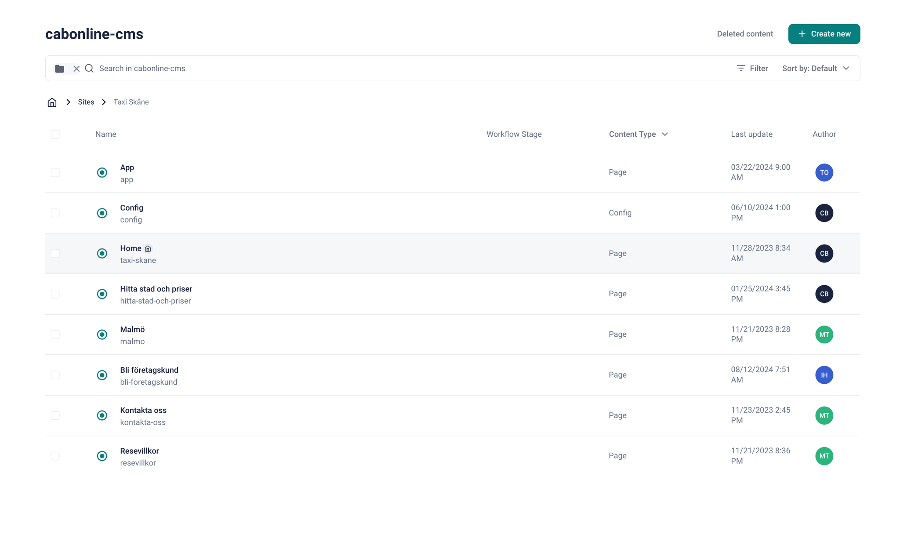

Det är egentligen JSON struktur som är baserat på en sida vi har skapat i content som  sedan
vi fyller med vår blocks (komponenter).

**Blocks / Komponenter**

Är byggstenar vi har skapat för kunna lägga in i våra storys.
Utan dessa blir våra storys tomma!

**Storys**

Slutgiltiga data som är sidan med byggstenarna vi har byggt.

# Vad är en story för kund/redaktör?

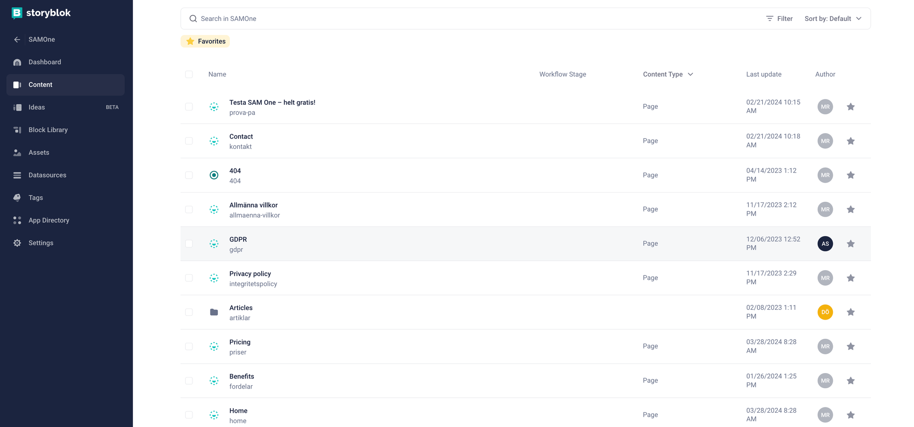

# Config / Globala komponenter

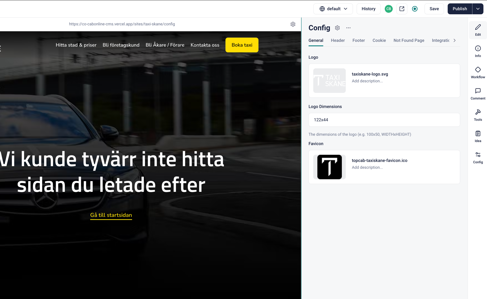

Genom att skapa ett Config story så kan vi lätt styra de globala komponenter som finns på en webbplats.  Se bild.

# SEO - Hur lägger vi till metataggar m.m?

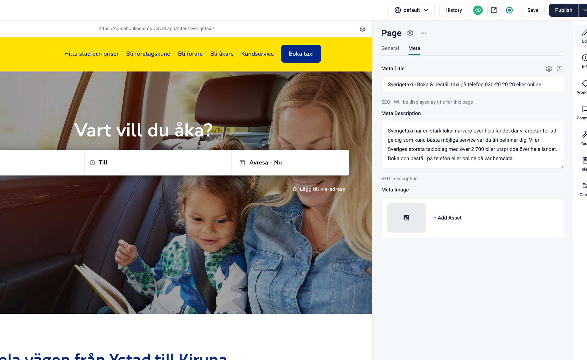

**Det går att installera tredjeparts appar för att använda SEO men det kostar tyvärr.**

Det vi kan göra istället är att i vårat content-type block “Page” så kan vi skapa ytterligare fält för meta datat och även lägga in det i egen flik.   Detta kan vi sedan konsumera i vår story vi hämtar från Storyblok. Se bild.

**Exempel på datastrukur som vi kan returnera till nextjs ekosystem (generateMetadata)**

```jsx
return  {
  title: "Din Webbsidetitel",
  description: "Beskrivning av sidan, max 150-160 tecken.",
  openGraph: {
    title: "Titel för delning på sociala medier",
    description: "Beskrivning av sidan för social delning",
    image: "https://exempel.com/bild.jpg",
    url: "https://exempel.com",
    type: "website"
  },
  twitter: {
    card: "summary_large_image",
    title: "Titel för Twitter-delning",
    description: "Beskrivning för Twitter-delning",
    image: "https://exempel.com/bild.jpg",
    site: "@dittkonto"
  },

};
```

**Exempel kod i CMS boilerplate:**

```jsx
  static async generateMetaFromStory(slug) {
    const { data } = await this.getStory({ slug: [slug] });
    if (!data) return {};
    const { content } = data;
    const { meta_title, meta_description } = content;

    return {
      title: meta_title,
      description: meta_description,
    };
  }
```

# Robots

Robots.txt som pekar mot vår sitemap samt bestämmer vilka regler som gäller för crawlern.

Det kan vi enkelt göra med robots.js i Nextjs 14+

```jsx
import SETTINGS from "@/settings";

export default function robots() {
  return {
    rules: {
      userAgent: "*",
      allow: "/*",
      disallow: "/api/",
    },
    sitemap: `${SETTINGS.SITE_URL}/sitemap.xml`,
  };
}

```

# Sitemap

Vi måste skapa en sitemap.xml som google crawlern kan besöka och indexera våra sidor.

Det kan vi enkelt göra med sitemap.js i Nextjs 14+

```jsx
import SETTINGS from "@/settings";
import { StoryBlokUtils } from "@/utils/cms";
import { storyblokInit, apiPlugin } from "@storyblok/react/rsc";

storyblokInit({
  accessToken: SETTINGS.CMS_PUBLIC_KEY,
  use: [apiPlugin],
});

export default async function sitemap() {
  try {
    const pages = (await StoryBlokUtils.getStaticPaths()).filter(
      (path) => path?.slug?.[0] !== "config"
    );

    const sitemap = pages.map((page) => {
      
      //Filter emptpy items and join nested routes 
      const slug = page?.slug.filter((item) => item !== "");
      let finalSlug = slug?.length > 0 ? slug.join("/") : slug;

      const url = `${SETTINGS.SITE_URL}/${finalSlug ?? ""}`;
      return {
        url: url,
        lastModified: new Date(),
        priority: 1,
      };
    });

    return sitemap;
  } catch (error) {
    return [];
  }
}

```

## Favikon

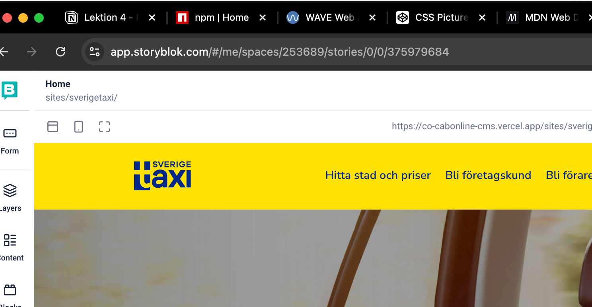

För att ersätta favikon kan vi antingen ersätta filen som ligger i repot alternativt skriva över det

genom att sätta det i layout.js.   Bilden ovan visar varje tab favikon i webbläsare fönstret.

```jsx
  <StoryblokProvider>
        <head>
          {favIcon && (
            <link rel="icon" href={favIcon} type="image/x-icon" sizes="16x16" />
          )}
        </head>
```

# Hantera språk (i18n)

Det finns egentligen två olika alternativ på att sätta upp språkhantering i storyblok.

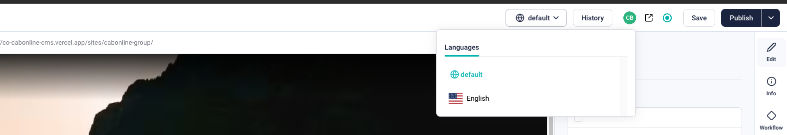

## **Single tree**

Som namnet beskriver finns det bara en trädstruktur i storyblok.  Här kommer man
jobba med nåt som heter **field level translations.**   Detta alternativ lämpar för webbplatser 
som vill ha flertal språk med exakt samma innehåll.

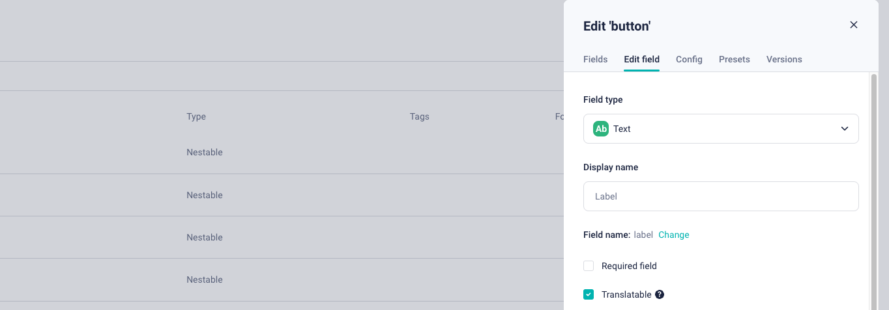

## **Single tree: Hur aktiverar vi field level translations?**

I våra komponenter kan vi aktivera  “Translatable” checkboxen.  Och även se till att vi har lagt till fler
språk i Settings.

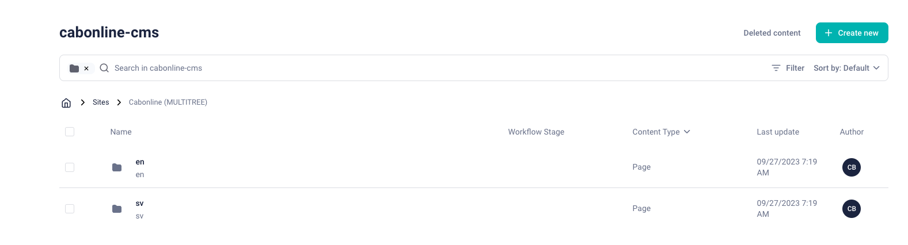

## **Multi tree (vi använder detta)**

Detta innebär att man har olika trädstrukturer för varje språk i storyblok. Det passar för webbplatser där innehållet kan variera från språk till språk. Varje "träd" kan anpassas individuellt baserat på språkets specifika behov.

# Vilken struktur vill man använda?

Vi diskuterar..

---

# Extra relevant för gruppuppgift

## Client vs Server components

Jag förklarar detta igen inom nextjs världen…

## Hur jobbar man med olika content-types (mallar)?

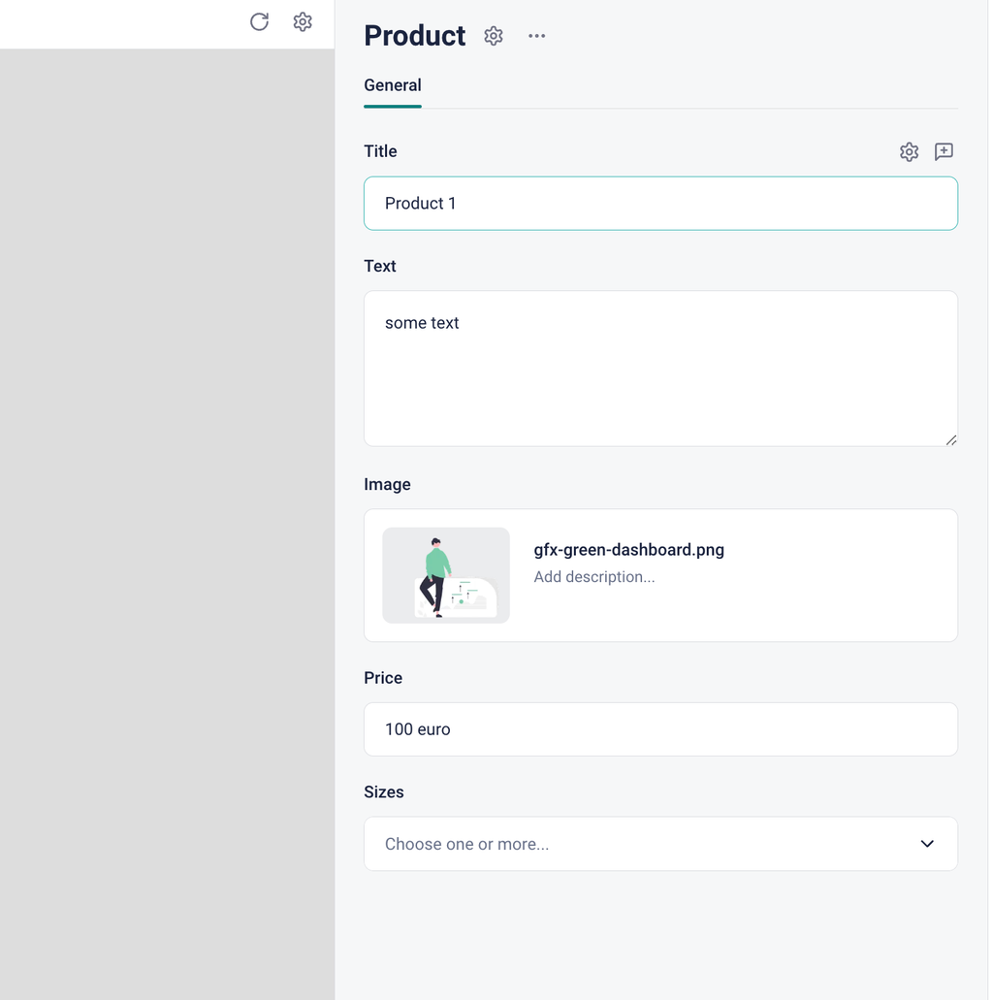

**Exempel med Product content-type**.
Med flertal fält som title, text, image, price och sizes så kan vi samla allt som är relevant till en produkt.

**Denna komponent är tanken att använda i en product detail sida.**

### Hur kan vi enkelt nå dessa produkter i en dropdown i Storyblok?

Exemplet nedan visar **Product List** komponent som har **Heading**, **Text** och **Products.
Products** fältet använder fälttyp **references** som vi kan välja att peka mot specifika storys.

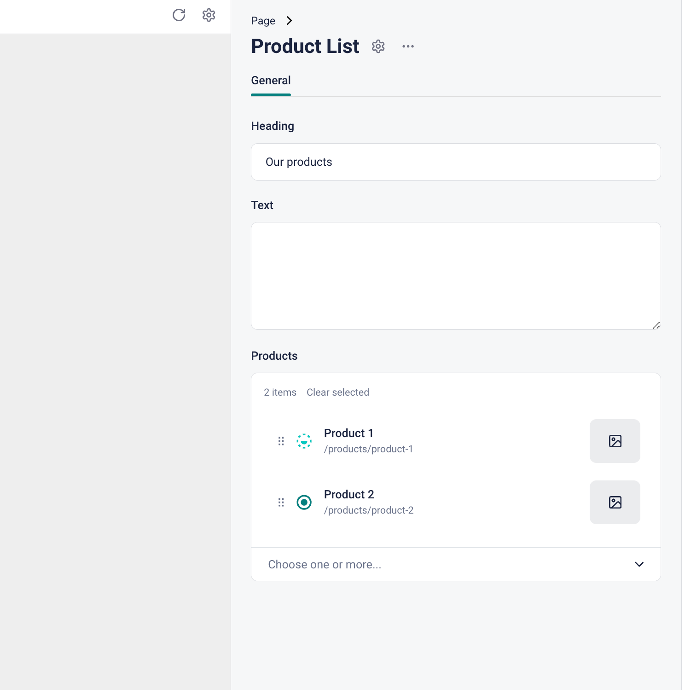

**References fälttyp har filtering mot product content-type.**
Resultatet blir att man kan bara välja “produkter” i listan, desto fler storys du har
skapat med content-type Product desto fler val får man!
****

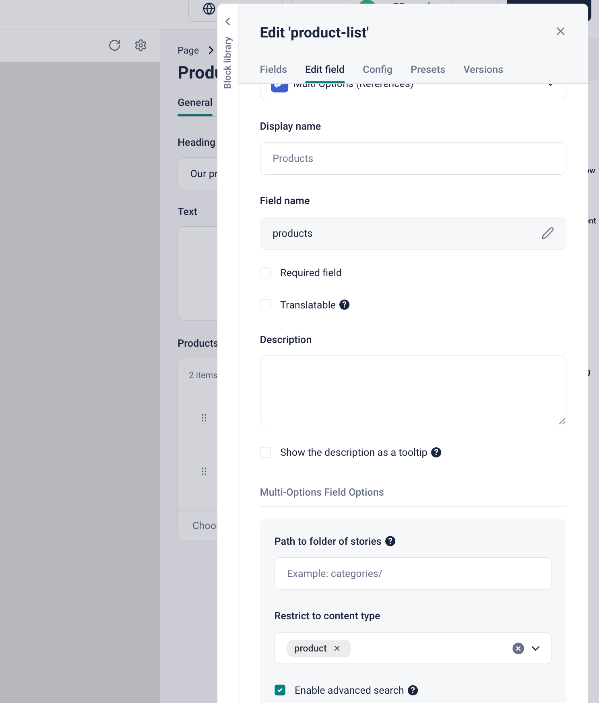

När man har valt sina produkter i product list så får man ett gäng UUIDS att filtrera mot.
**Exemplet nedan visar hur man kan göra!**

```jsx

export default async function ProductList({ blok }) {
  const products = await CMS.getProducts();
  const filteredProducts = products.filter((product) => blok?.products.includes(product.uuid));
  return (
    <section className="w-full bg-blue">
      <h1>{blok?.title}</h1>
      <p>{blok?.desc}</p>
      <div>
        {filteredProducts.map((product) => {
          const { slug } = product;
          const { id, title, text, image } = product.content;
          return (
            <Link href={`/products/${slug}`} key={id}>
              <div key={id}>
                <Image src={image?.filename} alt={title} width={200} height={200} />
                <h2 className="text-white">{title}</h2>
                <p className="text-white">{text}</p>
              </div>
            </Link>
          )
        })}
      </div>
    </section>
  )
}
```

**Uppgift  1 - Skapa en ny content-type block vid namn “Product”**

1. Lägg till fält **title**, **text**, **price** och **image**

**Uppgift  2 - Skapa en nytt nestable block “ProductList”**

1. Lägg till fält **title**, **text**,  **products** (multioption references)
2. Filtrera **products** fältet mot content-type “**Product**”

**Uppgift  4 - Skapa storys**

1. Skapa ny folder i content som heter **Products** med default content-type “**Product**”
2. Skapa en ny story med vår content type **“Product”**
3. Lägg till tre stories (kopiera första)
4. Skapa ny story med **Page** och lägg in **ProductList** i listan
5. Markera alla i produkter i products fältet

**Uppgift  4 - Inspektera Story JSON**

Vad ser du i objekt strukturen?

## Nestade komponenter

När man använder fältyp blocks i en komponent så man välja att nesta andra komponenter.

Vanligtvis gör man detta i ett grid, då är det viktigt att grid komponenten sköter layouten utav barnen.  Det går också att välja vilka komponenter man får välja i denna lista.

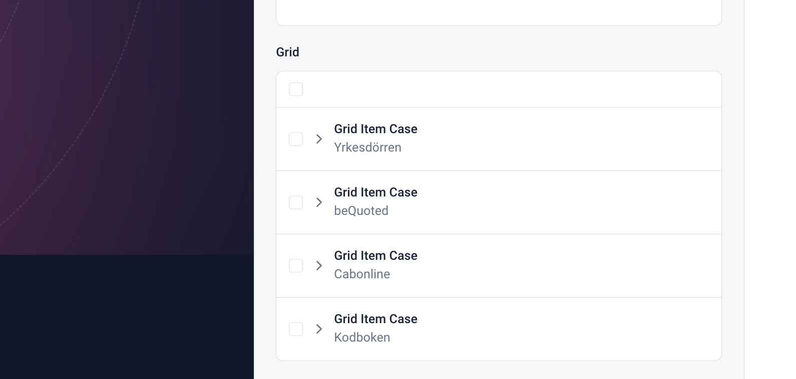

## Datasources

För att vi skall slippa repetera vissa datastrukturer så kan vi använda datasource för att återanvända i våra komponenter.

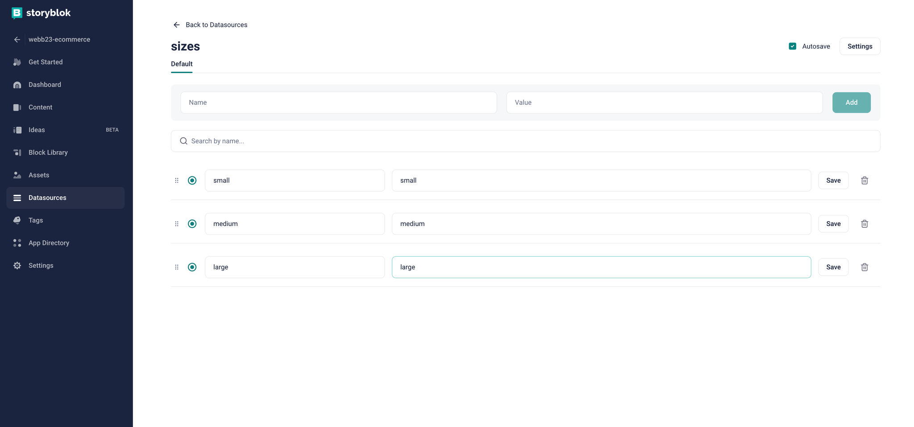

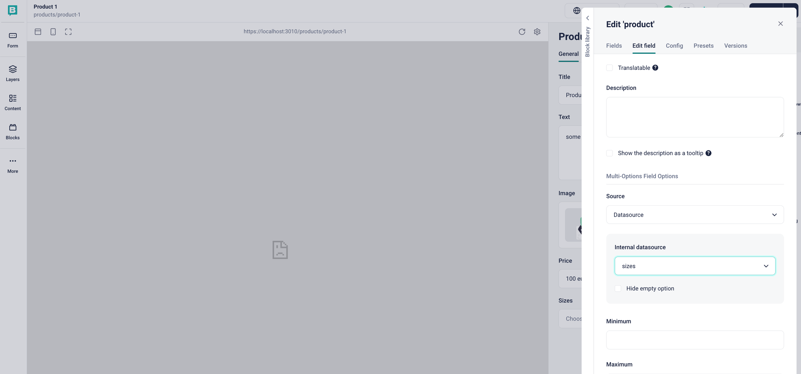

### Uppgift - **Skapa datasource och koppla till valfri komponent**

1. Skapa ny datasource under Datasources, kan vara vad som helst.
2. Koppla datasource till en komponent som har fälttyp single/multi option

## Hur kan vi hämta specifika stories?

Detta exempel nedan så jag har skapat en funktion i CMS klassen där jag väljer
att hämta produkter.  Läs docs för om du vill filtrera dina calls också.

https://www.storyblok.com/docs/api/content-delivery/v2/filter-queries/

**Exempel på hur vi hämtar specifika stories med starts_with**

```jsx
  
  //Exempel på sbParams
   let sbParams = { 
    version: sbVersion,
    starts_with: options.startsWith,
    sort_by: options.sortBy || 'first_published_at:desc',
    per_page: options.perPage || 25,
    page: options.page || 1,
    is_startpage: options.is_startpage || null,
    with_tag: options.with_tag || null,
    filter_query: options.filter_query || null,
    cv: sbCV
  }
  
  
  static async getProducts() {
    const productsResponse = await this.sbGet("cdn/stories", {
      starts_with: "products/",
      version: "draft",
    });

    return productsResponse.data.stories;
  }

```

**Storyblok js client**

Exempelvis när ni skall göra client calls så använder ni koden nedan.

```jsx
import StoryblokClient from "storyblok-js-client";

const Storyblok = new StoryblokClient({
    oauthToken: process.env.NEXT_PUBLIC_STORYBLOK_PREVIEW_TOKEN,
    cache: {
      clear: "auto",
      type: "memory",
    },
  });

  
export default Storyblok
```

**Exempel på hur vi hämtar specifika stories med Storyblok client i client miljö.**

```jsx
"use client"

import { CMS } from "@/utils/cms";
import Storyblok from "@/utils/storyblok-client";
import Link from "next/link";
import { useState } from "react";

export default function SearchBar() {

//Some state defined here...

	const handleSearch = async (e) => {
	
	const results = await Storyblok.get(`cdn/stories`, {
				search_term: e.target.value,
				filter_query: {
					component: {
						in: "product"
					}
				},
				token: YOUR_TOKEN,
				version: "draft",
				cv: Date.now()
			});
			
			//Set some state....
			//Maybe debounce this function
	};

	const renderProducts = () => {
		return searchResults?.map((story) => {
			return (
				<Link href={`/products/${story.slug}`} key={story.id}>
					<div key={story.id}>
						<p>{story.name}</p>
					</div>
				</Link>
			);
		});
	};

	return (
		<div className="flex w-full h-full">
			<input className="text-black" value={searchTerm} onChange={handleSearch} type="text" placeholder="Search" />
			{someState.length > 0 && renderProducts()}
		</div>
	);
}   
```

### Uppgift **- Installera Storyblok client och gör ett client call mot ditt space.**

Använd “use client” i din komponent för att du skall komma åt React hooks bland annat.

# Visual editor mot vår vercel miljö

För att redaktörer kan jobba enkelt så måste vi också kunna ansluta vår vercel miljö

till storyblok.   

1. Skapa staging branch
2. Skapa ny domain på vercel
3. Klistra in domain i Settings Visual editor